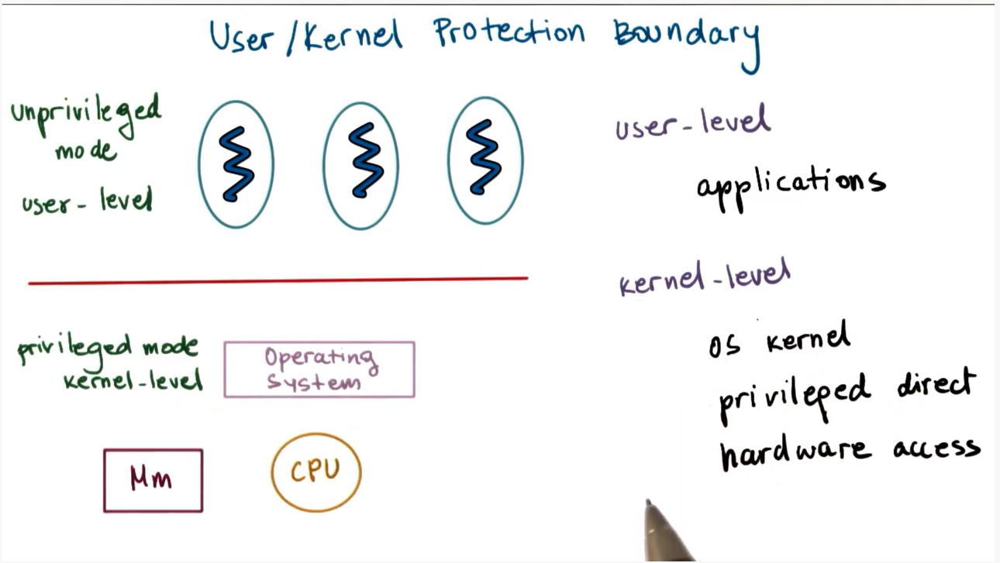

# What is an operating system?

## Simple Definition

a piece of software that: 

- **abstracts** (simplify what hardware looks like)
- **arbitrates** (to control the hardware use) 

the underlying hardware systems

## Shop Manager Metaphor

### A shop manager

- Directs operational resources: use of employee time, parts, tools
- Enforces working policies: fairness, safety, cleanup
- Mitigates difficulty of complex tasks: simplifies operation, optimizes performance

### An operating system

- Directs operational resources: use of CPU, memory, peripheral devices
- Enforces working policies: fair resource access, limits to resource usage
- Mitigates difficulty of complex tasks: abstract hardware details (system calls)

## What is OS?

Let's first look at the hardware of a computing system. This computing system consists of:

- Central Processing Unit (CPU)
- Physical Memory
- Network Interfaces (Ethernet/Wifi Card)
- GPU
- Storage Devices (Disk, Flash drives [USB])

In addition, a computing system can have higher level applications. These are the "programs" that we use every day on our computer:

- Skype
- Word
- Chrome

The Operating System is the layer of software that sits **between** the hardware components and the higher level applications.

### Main Functions of an Operating System

1.  Hide hardware complexity. 
    The operating system provides a higher level abstraction, the file, with a number of operations - like read and write - which applications can interact with.

2.  manages underlying hardware resources.  
    Operating system allocates memory for applications, schedules them for execution on the CPU, controls access to various network devices and so on.

3.  Provides isolation and protection. 
    When applications are running concurrently, the operation system has to ensure that they can do what they need to without hurting one another. For example, memory allocated to each application must not be readable/writable from another application.

## Operating System Definition

An operating system is a layer of systems software that:

- directly has privileged access to the underlying hardware
- hide the hardware complexity
- manages hardware on behalf of one or more applications according to some predefined policies.
- Ensures that applications are isolated and protected from one another

## Operating System Examples

Certain operating systems may target:

- desktop environment
- embedded environment
- a mainframe or a server environment

We will focus on operating systems for desktop environments and embedded environments.

For desktop operating systems we have:

- Microsoft Windows
- Unix-based
  - Mac OSX (BSD)
  - Linux (Ubuntu, Centos, Fedora)

For embedded operating systems:

- Android
- iOS
- Symbian

## OS Elements

To achieve its goals, an operating systems provides:

1. High level **abstractions**
2. **mechanisms** to operate on these abstractions.
3. **Policies** (how mechanisms will be used)

### Examples of abstractions

- application abstractions: process, thread
- hardware abstractions: file, socket, memory page

### Corresponding mechanisms

- create/schedule
- open/write/allocate

### Policies (how mechanisms will be used)

- least-recently used (LRU)
- earliest deadline first (EDF)

## OS Elements Example

Let's look at an example of memory management.

The main abstraction here is the memory page, which corresponds to some addressable region of memory of some fixed size.

The operating system integrates mechanisms to operate on that page like allocate, which actually allocates the memory in DRAM. It can also map that page into the address space of the process, so that the process can interact with the underlying DRAM.

Over time, the page may be moved to different spaces of memory, or may be moved to disk, but those who use the page abstraction don't have to worry about those details. That's the point of the abstraction.

How do we determine when to move the page from DRAM to disk? This is an example of a policy, and one such implementation of that policy would use the least-recently-used (LRU) algorithm, moving pages that have been accessed longest ago onto disk.

## Design Principles

### Separation of mechanism and policy

We want to incorporate flexible mechanisms that can support a number of policies.

For the example of memory, we can have many policies: LRU, LFU (least-frequently used), random. It is a good design strategy to create our memory management mechanisms such that they can generalize to these different policies.

In different settings, different policies make more sense.

### Optimize for the common case

- Where will the OS be used?
- What will the user want to execute on that machine?
- What are the workload requirements?

Understanding the common case - which may change in different contexts - helps the OS implement the correct policy, which of course relies on generalized mechanisms.

## OS Protection Boundary

Computer systems distinguish between at least two modes of execution:

- user-level (unprivileged)
- kernel-level (privileged)

Because an OS must have direct access to hardware, it must operate in kernel mode.

Applications generally operate in user-mode.

Hardware access can only be utilized in the kernel mode from the OS directly.

Crossing from user-level to kernel-level is supported by most modern operating systems.

As an example, the operating system can flip a bit in the CPU that allows applications executing instructions to have direct access to hardware resources. When the bit is not flipped, operations are forbidden.

When privileged instructions are encountered during a non-privileged execution, the application will be trapped. This means the application's execution will be interrupted, and control will be handed back to the OS.

The OS can decide whether to grant the access or potentially terminate the process.

The OS also exposes an interface of system calls, which the application can invoke, which allows privileged access of hardware resources for the application on behalf of the operating system.

For example:

- open (file)
- send (socket)
- mmap (memory)

Operating systems also support signals, which is a way for the operating system to send notifications to the application.
