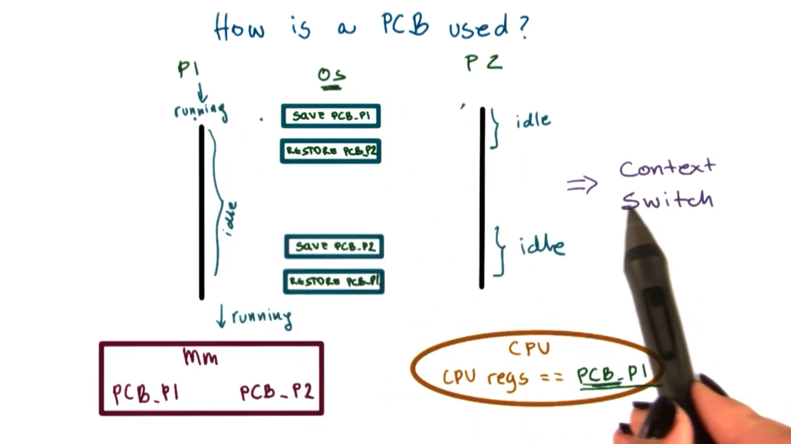
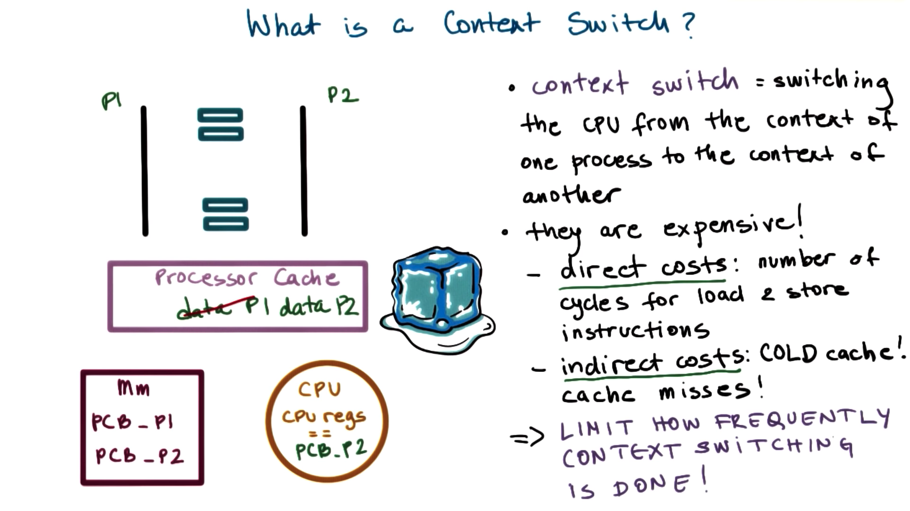
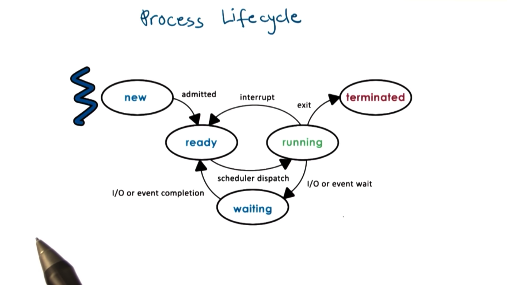

# Simple Process Definition

Instance of an executing program

Synonymous with **task** or **job**

# Toy Shop Metaphor

## An order of toys

- state of execution: completed toys, waiting to be built
- parts and temporary holding area: plastic pieces, containers
- may require special hardware: sewing machine, glue gun

## A process:

- state of execution: program counter, stack
- parts and temporary holding area: data, register state occupies state in memory
- may require special hardware: I/O devices

# What is Process

Operating system manages the hardware on behalf of **applications**

**Application** is a static entity which stored on disk

**Process** is launched application. It is loaded into memory and executed. A process is an active entity.

If the same program is launched more than once, multiple processes will be created. They will have the same instructions, but very different state.

# What Does a Process Look Like?

A process encapsulates all of the state of a running application. Every element of the process state has to be uniquely identified by its address.

An operating system abstraction used to encapsulate all of the process state is an **address space**

The address space is defined by a range of addresses V_0 to V_max. Different types of process state will appear in different regions of the address space.

Different types of process state in an address space

- The code
- The data available when process is first initialized (static state)
- Heap: Dynamically created state (what we create)

  Seems contiguous but there are holes filled with garbage (think of C struct not memset)

- Stack: Dynamically created state that grows and shrinks are the program executes LIFO Stack frames added and removed as functions are called and return

# Process Address Space

## Virtual Addresses

Potential range of addresses in process address space go from V_0 to V_max

Memory management hardware and components of the operating system maintain a mapping (**Page Table**) between virtual memory addresses and physical memory addresses. By using this mapping, we can _decouple_ the layout of the data in the virtual address space from the layout of the data in physical memory.

# Address Space and Memory Management

We may not have enough physical memory to store all a process's state even if we do need it. To deal with this overflow, the operating system decides dynamically which portion of the process's address space will live in physical memory and which portion will be swapped temporarily to disk.

Process share physical addresses sometimes. But operating system must check the validity of memory accesses to make sure that, say, process A isn't trying to write to memory mapped to by process B.

# Process Execution State

### program counter

Current executing line within a program

### CPU registers

The program counter as well as other data related to a current process's state are stored on CPU registers.

### Stack pointer

The top of process's stack

## process control block

To maintain all of this useful information for every single process

# Process Control Block

A process control block is a data structure that the operating system maintains for every process that it manages.

The PCB is created and initialized when the process is initially created.

Certain fields of the PCB may changed when process state changes.

- virtual / physical memory

Some fields can change often, like the **program counter**

- Stored within CPU registers (no update PCB every time)

- Save it to the PCB when the process is no longer running

# How is PCB Used

PCBs are stored in memory on behalf of a process by the operating system until it comes time for the process to start/resume execution. At that point, the process's PCB is loaded from memory into CPU registers, at which point instruction execution can begin.

If a process is interrupted by the operating system - perhaps to give another process some CPU time - the operating system must pull the PCB out of CPU registers and save it back into memory.

Each time the operating system switches between processes, we call this a **context switch**

# Context Switch

A mechanism used by the operating system to switch from the context of one process to the context of another process.

It is very **EXPENSIVE** so we want to limit how often we context switch

## Direct costs

number of CPU cycles required to load and store a new PCB to and from memory

## Indirect costs

When a process is running on the CPU a lot of its data is stored in the processor cache.

Accessing data from cache is faster than accessing from memory.

When we data we need is present in the cache, we say that the cache is **hot**. When a process gets swapped out, all of it's data is cleared from cache. The next time it is swapped in, the cache is **cold**.

# Process Life Cycle: States

# Process Life Cycle: Creation
