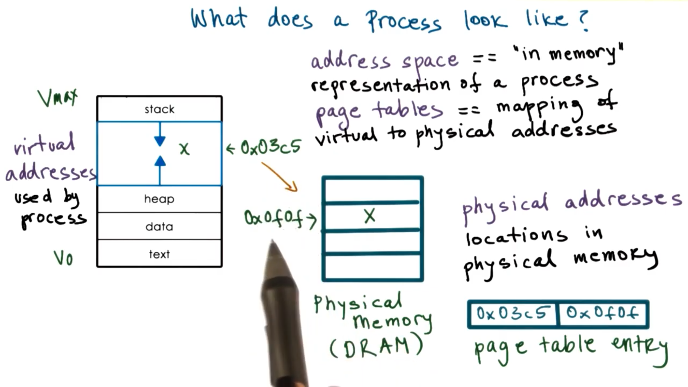

# Simple Process Definition

Instance of an executing program

Synonymous with **task** or **job**

# Toy Shop Metaphor

## An order of toys

- state of execution: completed toys, waiting to be built
- parts and temporary holding area: plastic pieces, containers
- may require special hardware: sewing machine, glue gun

## A process:

- state of execution: program counter, stack
- parts and temporary holding area: data, register state occupies state in memory
- may require special hardware: I/O devices

# What is Process

Operating system manages the hardware on behalf of **applications**

**Application** is a static entity which stored on disk

**Process** is launched application. It is loaded into memory and executed. A process is an active entity.

If the same program is launched more than once, multiple processes will be created. They will have the same instructions, but very different state.

# What Does a Process Look Like?

A process encapsulates all of the state of a running application. Every element of the process state has to be uniquely identified by its address.

An operating system abstraction used to encapsulate all of the process state is an **address space**

The address space is defined by a range of addresses V_0 to V_max. Different types of process state will appear in different regions of the address space.

Different types of process state in an address space

- The code
- The data available when process is first initialized (static state)
- Heap: Dynamically created state (what we create)

  Seems contiguous but there are holes filled with garbage (think of C struct not memset)

- Stack: Dynamically created state that grows and shrinks are the program executes LIFO Stack frames added and removed as functions are called and return

# Process Address Space

## Virtual Addresses

Potential range of addresses in process address space go from V_0 to V_max

Memory management hardware and components of the operating system maintain a mapping (**Page Table**) between virtual memory addresses and physical memory addresses. By using this mapping, we can _decouple_ the layout of the data in the virtual address space from the layout of the data in physical memory.
