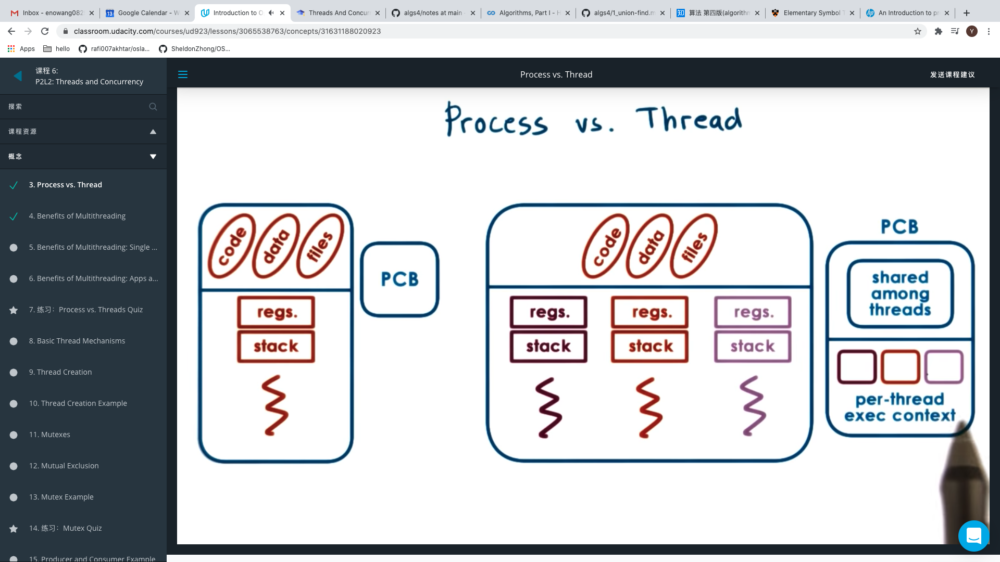

# Process vs. Thread

Threads represent multiple independent execution contexts within the same address space

A multithreaded process will have a more complex process control block structure, as these thread specific execution contexts needs to be incorporated.

# Benefits of Multithreading

1. Different threads can work in parallel on different components of the program's workload, which speeds up the program's execution.

   - For example, each thread may be processing a different component of the program's input.

2. Specialization

   If we designate certain threads to accomplish only certain tasks or certain types of task, we can take a specialized approach with how we choose to manage those threads. For instance, we can give higher priority to tasks that handle more important tasks or service higher paying customers.

   Performance of a thread depends on how much information can be stored in the processor cache. By having threads that are more specialized - that work on small subtasks within the main application - we can potentially have each thread keep it's entire state within the processor cache (hot cache), further enhancing the speed at the thread continuously performs it task.

## Why not just write a multiprocess application?

A multiprocess application requires a new address space for each process, while a multithreaded application requires only one address space

As a result, a multithreaded application is more likely to fit in memory, and not requires as many swaps from disk, which is another performance improvement.

As well, passing data between processes - inter process communication (IPC) - is more costly than inter thread communication, which consists primarily of reading/writing shared variables.

# Benefits of Multithreading: Single CPU
