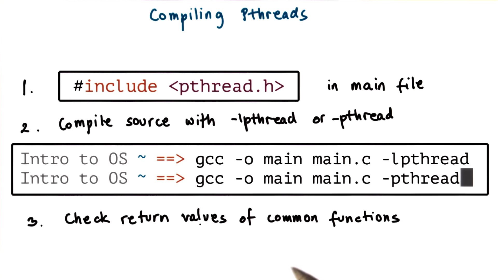
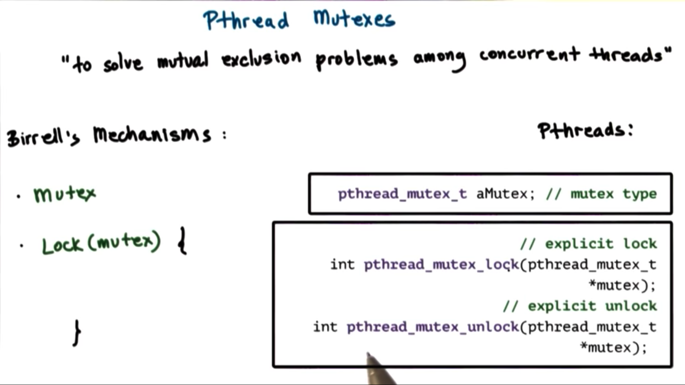
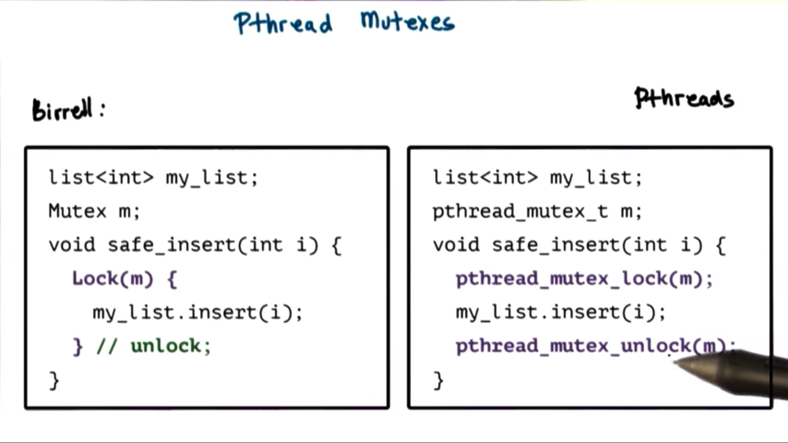
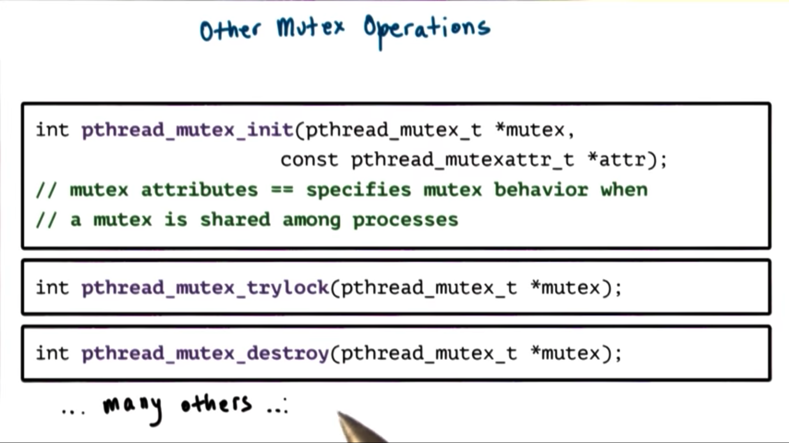
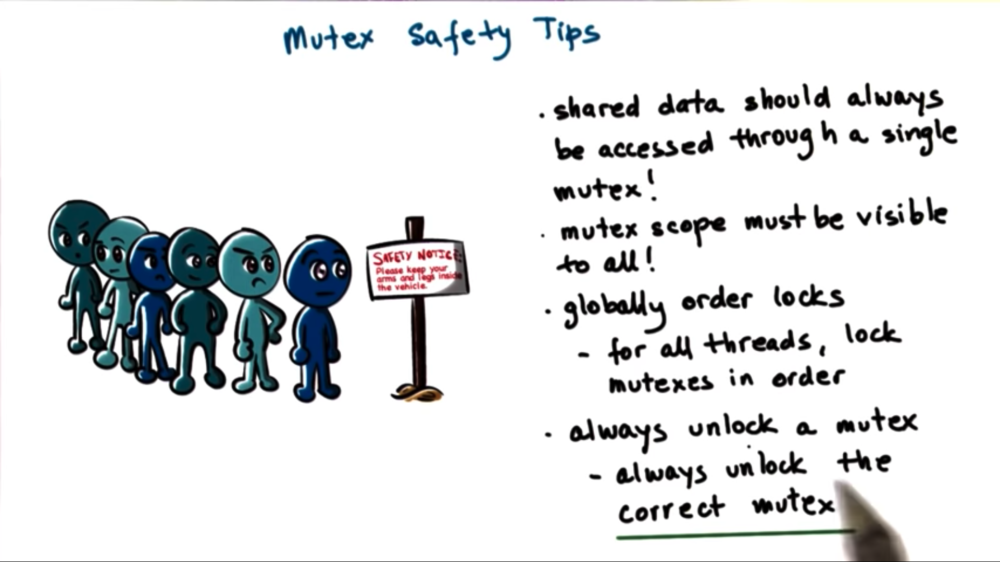
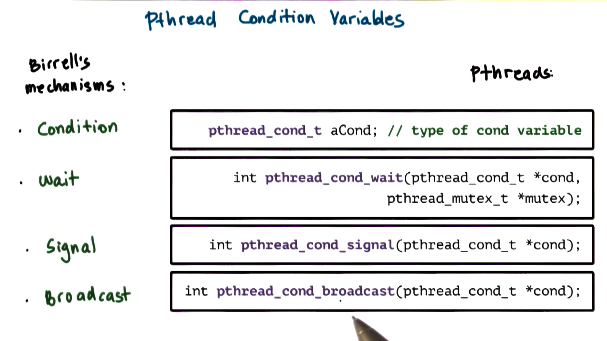
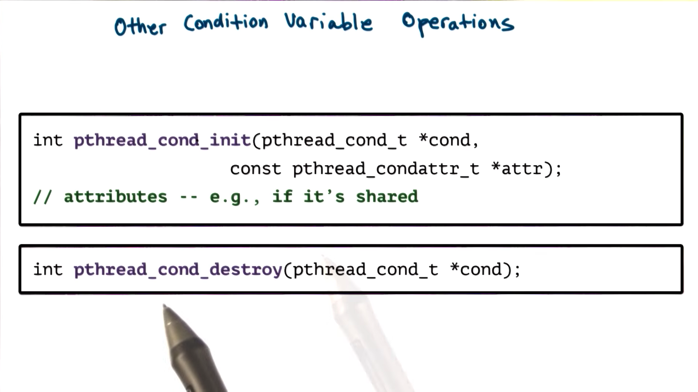
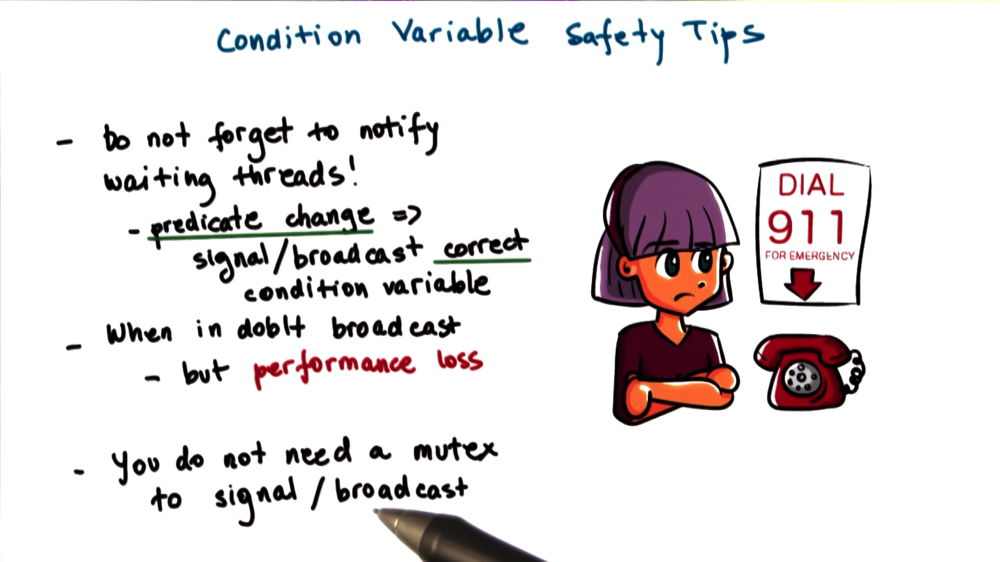

# PThread Creation

**pthread_t** - data type to represent threads

**pthread_attr_t** - set various options on the thread during creation

## Create Thread


```c
int pthread_create(pthread_t *thread, const pthread_attr_t *attr, void * (*start_routine)(void *), void *arg);
```

return value is whether the creation was a success or a failure.

## Thread Join

Child threads can be joined back to a parent thread with

```c
int pthread_join(pthread_t thread, void **status);
```

return value is whether the join was a success or a failure.

## Thread Attribute


### Data Structure

The **pthread_attr_t** data structure allows us to define features of the new thread we are creating, such as:

- stack size
- scheduling policy
- priority
- system/process scope
- inheritance
- joinable

### Pass As Null

If **NULL** is passed in the place of a **pthread_attr_t**, pthreads falls back to default behavior for the new thread.

### Operations

#### allocate and deallocate space

```c
int pthread_attr_init(pthread_attr_t *attr);
int pthread_attr_destroy(pthread_attr_t *attr);
```

#### set/get various attributes of that structure

```c
pthread_attr_{set/get}{attribute};
```

## Detachable Threads


In pthreads, the default behavior for thread creation is joinable threads. For a joinable (child) thread, the parent will not terminate until the child has completed their execution.

### Zombies Thread


Parent thread exits early

### Detached Thread


Detached threads cannot be joined back into the parent, allowing the parent to exit early and the child threads to continue their execution.

To detach threads, use

```c
int pthread_detach(pthread_t thread);
```

or

```c
pthread_attr_setdetachstate(attr, PTHREAD_CREATE_DETACHED);

// ...

pthread_create(..., attr, ...);
```

Since parent threads do not need to wait around until child threads complete, they can simply exit with **pthread_exit**

# Compiling PThreads



# PThread Creation Example 1

```c
#include <stdio.h>
#include <pthread.h>
#define NUM_THREADS 4

void *hello(void *args)
{
    /* thread main */
    printf("Hello Thread \n");
    return 0;
}

int main(void)
{
    int i;
    pthread_t tid[NUM_THREADS];
    for (int i = 0; i < NUM_THREADS; i++)
    {
        /* create/fork threads */
        pthread_create(&tid[i], NULL, hello, NULL);
    }
    for (int i = 0; i < NUM_THREADS; i++)
    {
        /* wait/join threads */
        pthread_join(tid[i], NULL);
    }

    return 0;
}
```

# PThread Creation Example 2

```c
#include <stdio.h>
#include <pthread.h>
#define NUM_THREADS 4

void *threadFunc(void *pArg)
{
    /* thread main */
    int *p = (int *)pArg;
    int myNum = *p;
    printf("Thread number %d\n", myNum);
    return 0;
}

int main(void)
{
    int i;
    pthread_t tid[NUM_THREADS];
    for (i = 0; i < NUM_THREADS; i++)
    {
        pthread_create(&tid[i], NULL, threadFunc, &i);
    }
    for (i = 0; i < NUM_THREADS; i++)
    {
        pthread_join(tid[i], NULL);
    }

    return 0;
}
```

# PThread Creation Example 3

A valid output for example 2

```bash
Thread Number 0
Thread Number 2
Thread Number 2
Thread Number 3
```

**i** is a global value, so when its value changes in one thread, all the other threads will see the new value.

## Data Race

One thread tries to read a value that another thread is modifying

## Correction

```c
    int tNum[NUM_THREADS];
    for (int i = 0; i < NUM_THREADS; i++)
    {
        tNum[i] = i;
        pthread_create(&tid[i], NULL, threadFunc, &tNum[i]);
    }
```

# PThread Mutexes

Mutual exclusion ensures that threads access shared state in a controlled manner, such that only thread at a time can apply modifications or otherwise access that shared variable



## Data Type

**pthread_mutex_t**

## Lock and Unlock



```c
int pthread_mutex_lock(pthread_mutex_t *mutex);
int pthread_mutex_unlock(pthread_mutex_t *mutex);
```

## Critical Section

Code between these two statements

## Mutexes Operations



### Mutexes Initialization

```c
int pthread_mutex_init(pthread_mutex_t *mutex, const pthread_mutexattr_t *attr);
```

#### pthread_mutexattr_t

Specify mutex behavior

Passing NULL gives us the default behavior

### TryLock

```c
int pthread_mutex_trylock(pthread_mutex_t *mutex);
```

Unlike **pthread_mutex_lock** which will cause the calling thread to block, this function will return immediately if the mutex cannot be acquired

### Destroy

```c
int pthread_mutex_destroy(pthread_mutex_t *mutex);
```

# Mutex Safety Tips

- shared data should always be accessed through single mutex
- mutex scope must be global
- globally order locks - lock mutexes in order (to prevent deadlocks)
- always unlock the (correct) mutex



# PThread Condition Variables

Condition variables are **synchronization mechanisms** that allow blocked threads to be notified when a certain condition occurs.



## Data Type

**the pthread_cond_t**

## Operations



### Wait

```c
int pthread_cond_wait(pthread_cond_t *cond, pthread_mutex_t *mutex);
```

It releases **mutex** and places itself on the wait queue associated with the **condition variable**. When the thread is woken up, it will automatically reacquire **mutex** before exiting the wait operation

### Signal and Broadcast

```c
int pthread_cond_signal(pthread_cond_t *cond);

int pthread_cond_broadcast(pthread_cont *cond);
```

### Allocate and Destroy

```c
int pthread_cond_init(pthread_cond_t *cond, const pthread_condattr_t *attr);


int pthread_cond_destroy(pthread_cond_t *cond);
```

# Condition Variable Safety Tips



- Don't forget to notify waiting threads! - When a condition changes, make sure to signal/broadcast the correct condition variable

- When in doubt use broadcast! - Using broadcast incorrectly can incur a performance loss, but using signal incorrectly make cause your program to execute incorrectly.

- You don't need a mutex to signal/broadcast - May be best to notify after unlocking mutex to prevent spurious wake ups.

# Producer and Consumer Example

## Global State

```c
#include <stdio.h>
#include <stdlib.h>
#include <pthread.h>

#define BUF_SIZE 3 /* size of shared buffer */

int buffer[BUF_SIZE];                             /* shared buffer */
int add = 0;                                      /* place to add next element */
int rem = 0;                                      /* place to remove next element */
int num = 0;                                      /* number element in buffer */
pthread_mutex_t m = PTHREAD_MUTEX_INITIALIZER;    /* mutex lock for buffer */
pthread_cond_t c_cons = PTHREAD_COND_INITIALIZER; /* consumer waits on cv */
pthread_cond_t c_prod = PTHREAD_COND_INITIALIZER; /* producer waits on cv */

void *producer(void *param);
void *consumer(void *param);
```

## Main

```c
int main(int argc, char *argv[])
{
    pthread_t tid1, tid2; /* thread identifiers */
    int i;
    if (pthread_create(&tid1, NULL, producer, NULL) != 0)
    {
        fprintf(stderr, "Unable to create producer thread\n");
        exit(1);
    }
    if (pthread_create(&tid2, NULL, consumer, NULL) != 0)
    {
        fprintf(stderr, "Unable to create consumer thread\n");
        exit(1);
    }
    pthread_join(tid1, NULL); /* wait for producer to exit */
    pthread_join(tid2, NULL); /* wait for consumer to exit */
    printf("Parent quiting \n");
}
```

## Producer

```c
void *producer(void *param)
{
    int i;
    for (int i = 1; i <= 20; i++)
    {
        pthread_mutex_lock(&m);

        if (num > BUF_SIZE)
        {
            exit(1); /* buffer overflow */
        }
        while (num == BUF_SIZE)
        {
            pthread_cond_wait(&c_prod, &m); /* block if buffer is full */
        }
        buffer[add] = i; /* buffer not full, so add element */
        add = (add + 1) % BUF_SIZE;
        num++;
        printf("producer: inserted %d\n", i);
        pthread_mutex_unlock(&m);
        pthread_cond_signal(&c_cons);
        fflush(stdout);
    }
    printf("Producer thread quiting \n");
    fflush(stdout);
    return 0;
}
```

## Consumer

```c
void *consumer(void *param)
{
    int i;
    while (1)
    {
        pthread_mutex_lock(&m);

        if (num < 0)
        {
            exit(1); /* buffer underflow */
        }
        while (num == 0)
        {
            pthread_cond_wait(&c_cons, &m); /* block if buffer is empty */
        }
        i = buffer[rem]; /* buffer not empty, so remove element */
        rem = (rem + 1) % BUF_SIZE;
        num--;
        printf("Consume value %d\n", i);
        pthread_mutex_unlock(&m);
        pthread_cond_signal(&c_prod);
        fflush(stdout);
    }
    return 0;
}
```
