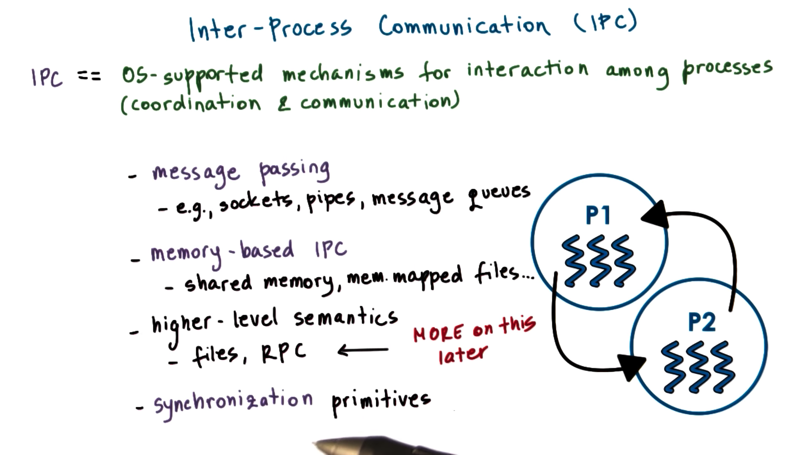
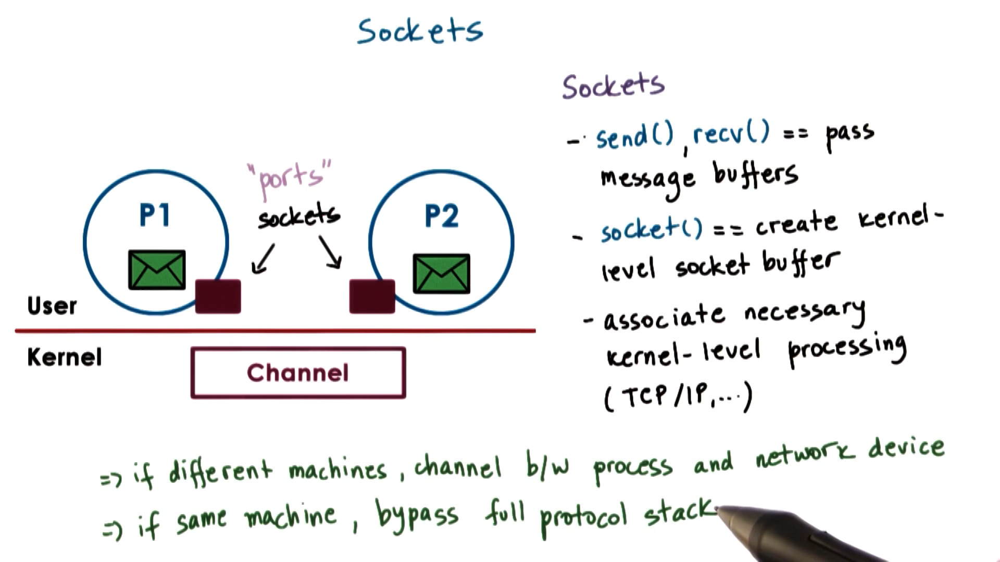

# Inter Process Communication

Os-support mechanismsfor interation among processes

- Coordination

- Communication

## Four Types

### Message Passing

Sockets, pipes, and message queues...

### Memory-Based IPC

Utilizes shared memory

- Unstructured shared physical memory pages

- memory mapped files which can be accessed by multiple processes

### Higher-Level Semantics

**RPC** is more than a **channel** for passing information between processes

Provides additional details
- Data format
- Data exchange procedure

### Synchronization primitives

Metexes



# Message Based IPC

**Processes** create messages and then send and receive them

**OS** creats and maintains the channel to send messages


The **OS** provides an **interface** to the processes so that they can send messages via this channel

The **processes** send/write messages to a port, and then recv/read messages from a port

The **channel** is responsible for passing the message from one port to the other

## OS responsibility

Establish the communication and perform each IPC operation

Every send and receive call requires a system call and a data copy. When we send, the data must be copied from the process address space into the communication channel. When we receive, the datais copied from the communication channel into the process address space


## Pros

Simplicity

## Cons

### Overheads calls

A request-response interaction between two processes requires **four** user/kernel crossings and **four** data copying operations

# Forms of Message Passing

The are several ways to implement message-based IPC

## Pipes

Pipes are characterized by two endpoints

No notion of a message with pipes. just a stream of bytes pushed into the pipe from one process and read from the pipe by the other process


One popular use of pipes is to connect the output from one process to the input of another.

```c
// The | is the pipe operator. Here we pipe the output of `cat`
//  into `grep`.

cat /some/really/large/file | grep "needle in a haystack"
```

## Message Queues

A sending process must submit a properly formatted message to the channel, and then the channel can deliver this message to the receiving process


The OS level functionality regarding message queues includes mechanisms for message priority, custom message scheduling and more

Supported via different APIs in Unix-based systems
- SysV
- POSIX

## Sockets

The socket API supports send and recv operations that allow processes to send message buffers in and out of the kernel-level communication buffer



The socket creates a kernel-level socket buffer. In addition, it will associate any kernel level processing that needs to be associated with the socket along with the actual message movement

For instance, the socket may be a TCP/IP socket, which means that the entire TCP/IP protocol stack is associated with the socket buffer

## On same machine

Bypass full protocal stack

## On different machines

Communication buffer is between the process and the network device that will actually send the data

# Shared Memory IPC

OS establishes the **shared memory channel** between the processes

OS will map certain physical pages in memory into the virtual address spaces of both processes. The virtual addresses in each process pointing a shared physical location do not have to be the same. In addition, the shared physical memory section does not need to be contiguous


## Pros

- Once the physical memory is mapped into both address spaces, os is out of the way. System calls are used only in the setup phase

- Data copies are reduced, but not necessarily avoided. For data to be available to both process, it needs to explicitly be allocated from the virtual addresses the belong to the shared memory region. If that is not the case, the data within the same address space needs to be copied in and out of the shared memory region

## Cons

Since the shared memory area can be concurrently accessed by both processes, this means that processes must **explicitly synchronize** their shared memory operations. In addition, it is now the developer's responsibility to handle any protocol-related implementations, which adds to the complexity of the application

## Examples

Unix-based system support two popular shared memory APIs: SysV and POSIX. In addition, shared memory IPC can be established between processes by using a memory-mapped file


# Copy vs. Map

## Goal of IPC

Transfer data from the address space of one process to the address space of another process

## Message-based IPC

CPU **copy** data, and CPU cycles are spent every time data is copied to/from ports

## Memory-based IPC

CPU cycles are spent to **map** physical memory into the address spaces of the processes

The CPU also copy data into the shared address space, but note that there is no user/kernel switching in this case

## Comparasion

The **memory-mapping operation** is costly, but it is a one time cost, and can pay off even if IPC is performed once. In particular, when we need to move large amounts of data from one address space to another address space, the time it takes to copy - via message-based IPC - greatly exceeds the setup cost of the setup mapping performed in memory-based IPC

## Windows LPC

If data is smaller than a certain threshold, the data is copied in and out of a **communication channel** via a port-like interface. Otherwise the data is mapped into the address space of the target process. This mechanism is called **Local Procedure Calls (LPC)**.

# SysV Shared Memory

OS supports **segments** of shared memory
- not necessarily contiguous physical pages

**Shared Memory** is system-wide
- system limites on number of segments and total size

- limit on the total number of segments and the total size of the shared memory
    - Currently in Linux the limit is 4000 segments, although in the past it was as few as 6.

## Process

### Create

OS allocates the required amount of physical memory and then assigns to it a unique key

Another process can refer to this segment using this key

### Attach

OS establishes a valid mapping between the virtual addresses and the physical addresses

Multiple processes can attach to the same shared memory segment

Reads and writes to these segments will be visible across all attached processes

### Detach

invalidate the virtual address mappings for the virtual address

The page table entries for those virtual addresses will no longer be valid

### Destroy

A segment is not really destroyed once it is detached. A segment may be attached, detached and re-attached by multiple processes many times through its lifetime

Once a segment is created, it's essentially a persistent entity until there is an explicit request for it to be destroyed. Note that this is very different from memory that is local to a process, which is reclaimed when the process exits


# SysV Shared Memory API


## Create

```c
shmget(shmid, size, flag)
```
Size ->  size of the segment

flag -> permission flags ...

shmid -> key that references the shared memory segment

## Generate shmid

```c
ftok(pathname, proj_id)
```

Generates a token based on its arguments

It's a hashing function

- If you pass it the same arguments you will always get the same key
- Different processes can agree upon how they will obtain a unique key for the memory segment

## Attach

```c
shmat(shmid, addr, flags)
```
addr - provide the virtual addresses to which the segment should be mapped, using the addr argument
- If NULL is passed, os will choose some suitable addresses.

## Detach

```c
shmdt(shmid)
```

## Destroy

```c
shmctl(shmid, cmd, buf)
```

If we specify IPC_RMID as the cmd, we can destroy the segment.

# POSIX Shared Memory API

Doesn't use segments, but rather uses **files**

-  not "real" files
- Live in the **tmpfs** filesystem which is a bunch of state that is present in physical memory.
- The OS uses the same representation and the same data structures that are used for representing a file to represent a bunch of pages in physical memory that correspond to a share memory region

No need for the key generation process

## APIs


# Shared Memory and Sync

Accesses to shared menory must be synchronized

## Synchronization Methods

### Option 1 Threading Libraries

For example, two pthreads processes can synchronize amongst each other using pthreads mutexes and condition variables

### Option 2 OS-supported IPC for Synchronization

### Requirements

Must coordiante:
1. Number of concurrent accesses to shared segments

2. When data is available or ready for consumption

# PThreads Sync for IPC

## PTHREAD_PROCESS_SHARED

Attribute to pecify the properties of the mutex or the condition variable when they are created

Whether or not the synchronization variable is private to a process or shared amongst processes

These data structures must live in shared memory (globally)

## Code Example

```c
// ...make shm data struct
typedef struct {
  pthread_mutex_t mutex;
  char *data;
} shm_data_struct, *shm_data_struct_t;

// ... create shm segment
seg = shmget(ftok(arg[0], 120), 1024, IPC_CREATE|IPC_EXCL));
shm_address = shmat(seg, (void *) 0, 0);
shm_ptr = (shm_data_struct_t_)shm_address;

// ...create and init mutex
pthread_mutexattr_t(&m_attr);
pthread_mutexattr_set_pshared(&m_attr, PTHREAD_PROCESS_SHARED);
pthread_mutex_init(&shm_prt.mutex, &m_attr);
```

# Sync for Other IPC

**PTHREAD_PROCESS_SHARED** option for pthreads isn't necessarily always supported on every platform


## Message Queues

We can implement mutual exclusion via **send/recv** operations

For example, process A can write to the data in shared memory and then send a "ready" message into the queue. Process B can receive the msg, read the data, and send an "ok" message back

## Semaphores

Binary semaphore can have two states, 0 or 1

When the semaphore has a value of 0, the process will be blocked

When the semaphore has a value of 1, the process will decrement the value (to 0) and will proceed

# IPC Command Line Tools


# Shared Mem Design Consideration


# Design Considerations

Consireding two mult-thread processes as example

## How many segments?

### One large segment

Need a manager for allocating and freeing memory for **shared segment**

### Multiple small segments

Pre-allocate a pool of segments ahead of time, so no need to incur the cost of creating a segment in the middle of execution

Communicate segment IDs among processes

## What size segments? What if data doesn't fit?

### Segment size == data size

- Works well for well-known data structure
- limit on the maximum size

### Segment size < message size

Transfer data in rounds

Need to include some protocols to track the progress of the data movement through the shared memory segment
