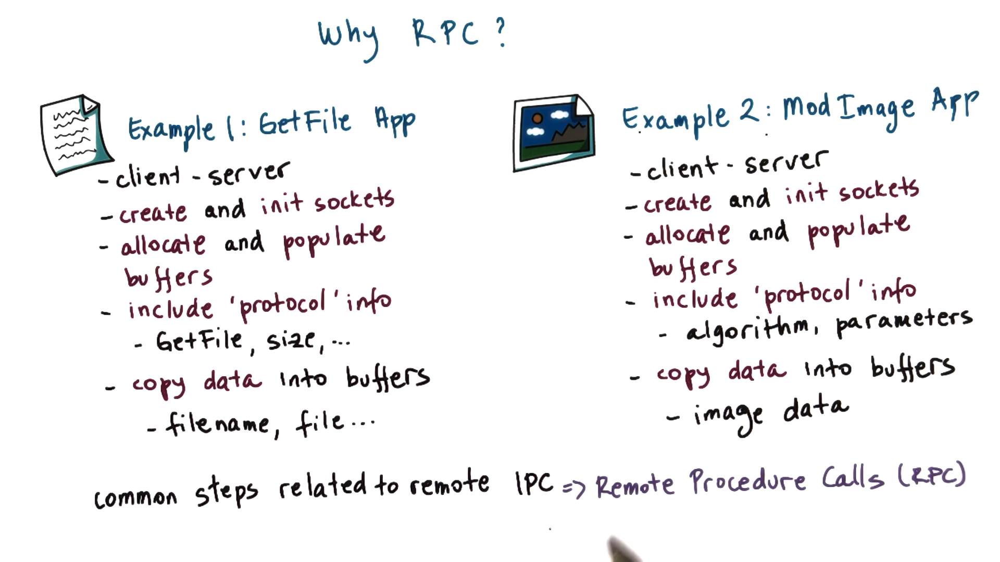
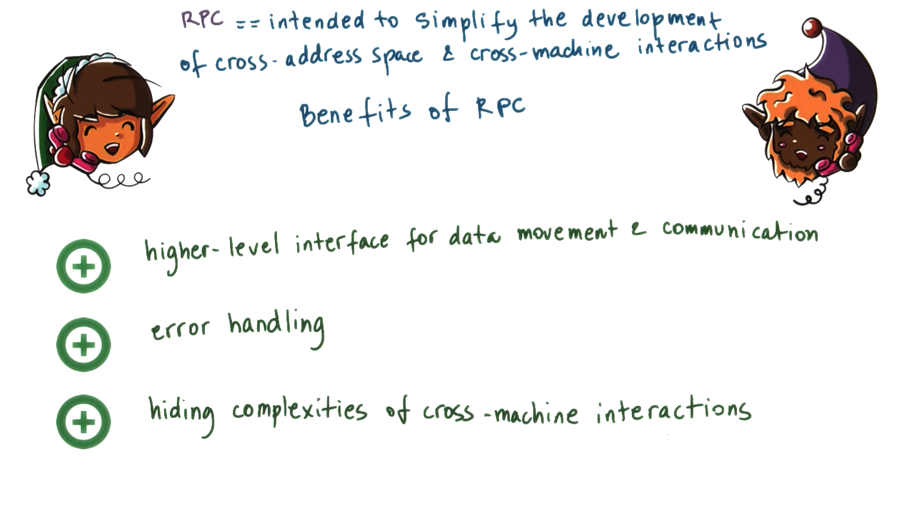
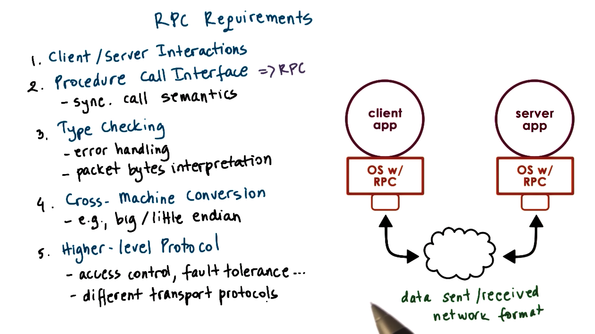
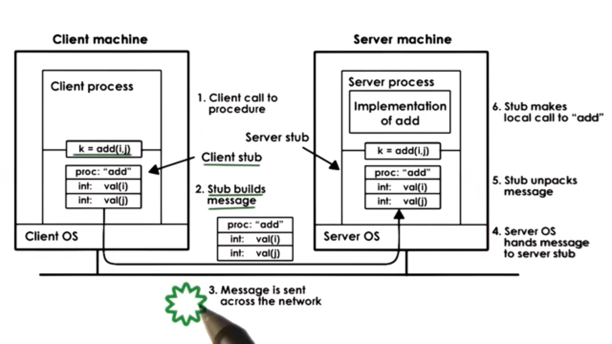
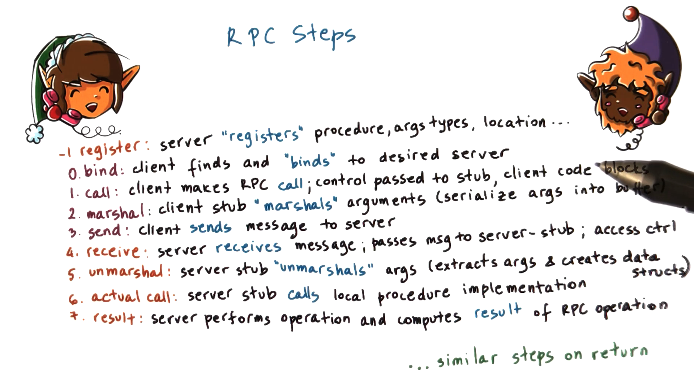
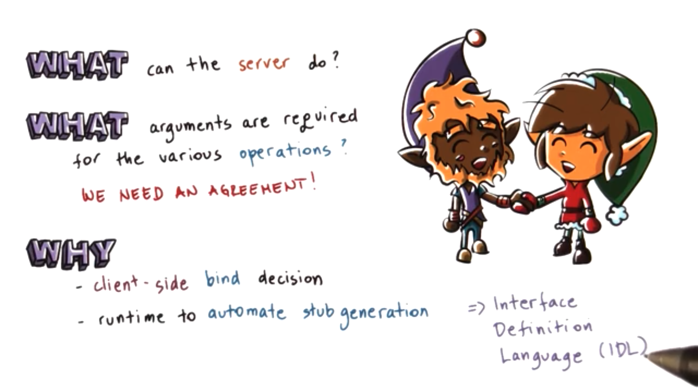
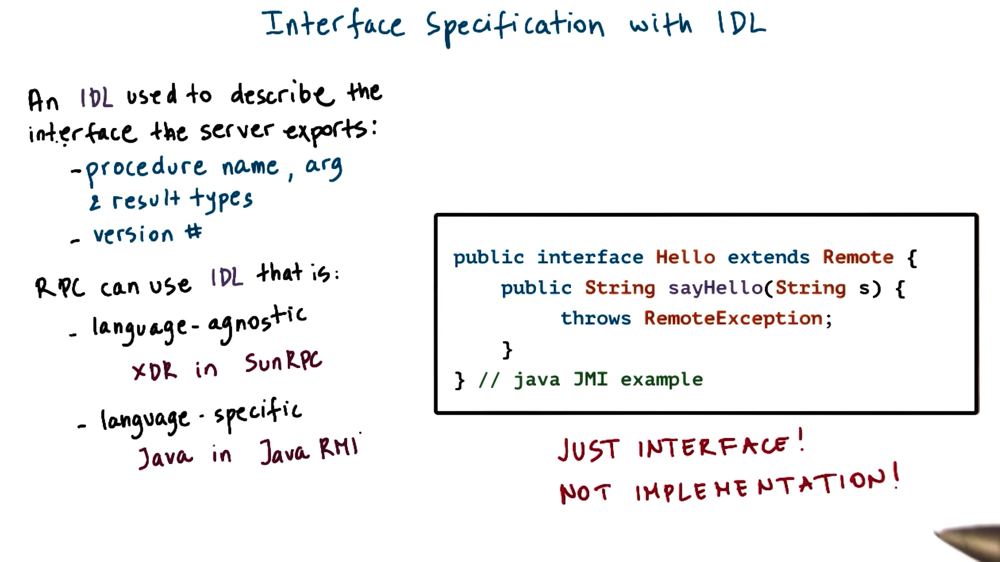
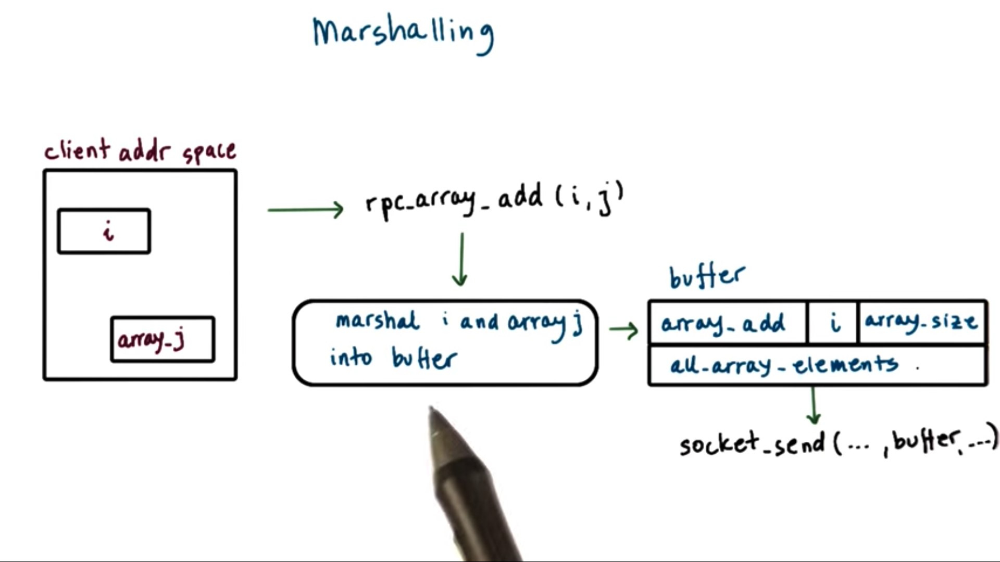
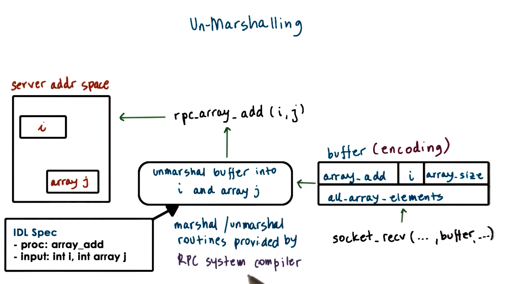
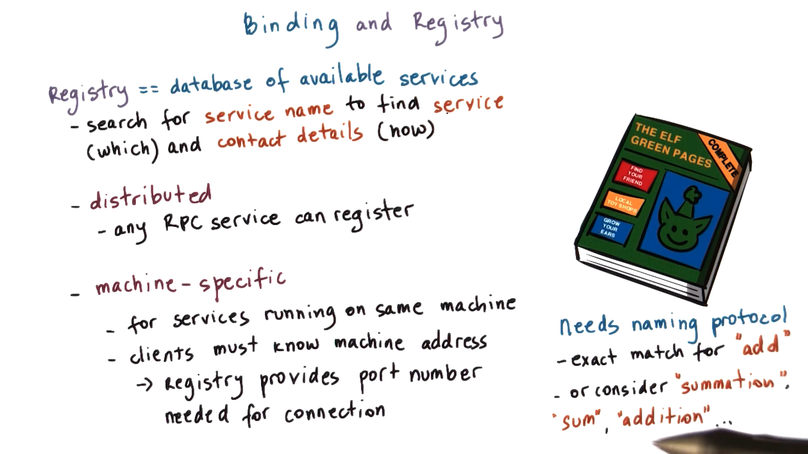

# Why RPC?

Two examples

1. Client gets a file from the server
2. Client sends an image to the server for processing/modification



Setup for both applications is very similar

RPC simplify basic setup steps

# Benefits of RPC

RPC - intended to simplify the development of interactions across address spaces and machines

1. Offers a high-level interface for data movement and communication

    Developer can focus more on what their application but not standard boilerplate setup

2. Handle errors

    Errors arise from low-level communication/transmission interactions

3. Hide complexities of cross-machine interactions



# RPC Requirements



## Client/server interactions

The server performs complex tasks, and the client needs to know how to communicate with server

## Procedure Call Interface => RPC

RPCs have synchronous call semantics

When a process makes a remote procedure call, the calling process will block until the procedure completes and returns the result

## Type checking

- Error Handling

- Packet bytes interpretation

If you pass an argument of the wrong type to an RPC, you will receive error

When packets are being sent between two machines, they are just a stream of bytes. RPC runtime interpret the bytes

## Cross-Machine Conversion

Client and Server may be different in representing certain data types

The RPC system hide differences from the programmer, ensuring that the data is correctly transported and converted

## High-Level protocol

UDP, TCP or others - to communicate

RPC should also incorporate some higher level mechanisms like access control, authentication, and fault tolerance.

# Structure of RPC

**Client** -> perform addition

**Server** -> calculator



## Client

Client call the function add with i and j.

The execution will also jump to another location in the address space - **stub implementation**. To the rest of the process, this stub will look like the real add.

Client stub create a **buffer** and populate that buffer with all of the appropriate information. Then, the RPC runtime sends the buffer to the server process. This may be via TCP/IP sockets or some other transport-level protocol

The stub code itself is automatically generated via some tools that are part of the RPC package. No need for programmer

## Server

Packets are handed off to the server stub

The stub parse all of the received bytes, and then make a call to the local add function with i and j

The server will then create a buffer for the result and send it back to the client via the appropriate connection. The packets will be received by the client stub, and the information will be stored in the client address space

Finally, the client function will return

# Steps in RPC



## Bind

For connection-based protocols (like TCP/IP), the actual connection will be established in this step.

## Makes actual RPC call

Control is passed to the stub, blocking the rest of the client

## Marshal

The client stub creates a data buffer, and populates it with the arguments that are passed in

### Why need it?

The arguments may located in noncontiguous memory locations within the client address space. But transport level requires a contiguous buffer

## Send

Via transmission protocol the client and server have agreed upon during the binding process

## Receive

By RPC runtime on server

Determine which server stub the request needs to be delivered to

## Unmarshall

Extracting necessary byte sequences from the buffer and populating the appropriate data structures

## Actual call

Call the implementation of the procedure

## Result

Compute the result of the operation, which will be passed to the server side stub and returned to the client

## Register

Before binding, the server must execute a registration step to let the world know what procedures it supports, what arguments it requires, and what location it can communicated with at

# Interface Design Language



When using RPC, the client and the server don't need to be developed together. The can be written by different developers in different programming languages.

Server can explicitly define what procedures it supports and what arguments it requires

This information is needed so that the client can determine which server it needs to bind with

The IDL serves as a protocol of how the client-server agreement will be expressed

# Specifying an IDL



An interface definition language is used to describe the interface that particular server exports

IDL is used to define the interface but not for the implementation of the service

## Components

- Procedure name
- Argument  types
- Result type
- Version number

## Types

### Language-agnostic

eXternal Data Representation (XDR) -> SunRPC

### Language-specific

Java RMI -> Java

# Marshalling

Marshaling process **encodes** the data into an agreed upon format so that it can be correctly interpreted by the server

This encoding specifies the layout of the data upon serialization into a byte stream



# Unmarshalling

Unmarshalling code extract the correct chunks of bytes from the buffer and use those bytes to initialize data structures that correspond to the argument types

As a result of the unmarshalling process, the i and j variables will be allocated in the server address space and will be initialized to values that correspond to whatever was placed into the buffer sent by the client

RPC systems include a special compiler that takes an IDL specification and generates the marshaling/unmarshalling routines



# Binding and Registry

## Binding

Used by the **client** to determine

- which server to connect to
    -  based on the service name and the version number.

-  how to connect to a particular server
   -  IP address, network protocol ...

## Registry



To support binding, **registry** maintains a database of all available services

You pass registry the name of the service and the version you are looking for, and you receive the contact information for the matching server including the IP address, port, and transport protocol

### Distributed Registry

Any RPC service can register

### Distributed Registry

Only knows about the processes running on local machine

In this case, clients must know the machine address of the host running the service, and the registry need only provide the port number that the service is running on

### Naming protocol

The simplest approach requires that the client specifies the exact name and version number of the service it requires

A more sophisticated naming scheme consider synonyms. Requesting the sum service might still get you the add service

# Pointers in RPC

In regular local procedures, it makes sense to allow pointer arguments. The pointer references some address within the address space of both the calling procedure and the called procedure, so the pointer can be dereferenced with no issue.

In RPC, this makes no sense. The pointer points to some particular data in the caller address space, and some arbitrary data in the remote address space.

To solve this problem, an RPC system can disallow pointers to be used an arguments to any RPC procedure.

Another solution allows pointers to be used, but ensures that the referenced data - not the pointer - is marshaled into the transmitted buffer.

On the server side, once the data is unpacked, the unmarshalling code will pass the address of this data to the local procedure.

In this way, RPC allows pointers to be "passed" between the client and the server.

# Handling Partial Failures

When a client hangs while waiting on a remote procedure call, it is often difficult to pinpoint the problem.

Is the server down? Is the service down? Is the network down? Is the message lost?

Even if the RPC runtime incorporates some timeout/retry mechanisms, there are still no guarantees that the problem will be resolved or that the runtime will be able to provide some better insight into the problem.

RPC systems incorporate a special error notification that tries to capture what went wrong with an RPC request without claiming to provide the exact detail. This serves as a catch all for all types of (partial) failures that can potentially happen during an RPC call.

# What is SunRPC?

SunRPC is an RPC package originally developed by Sun in the 1980s for UNIX systems. It is now widely available on other platforms.

SunRPC makes the following design choices.

In SunRPC, it is assumed that the server machine is known up front, and therefore the registry design choice is such that there is a registry per machine. When a client wants to talk to a particular service, it must first talk to the registry on that particular machine.

SunRPC makes no assumption regarding the programming language used by the client or the server. Sun RPC relies on a language-agnostic IDL - XDR - which is used both for the specification of the interface and for the specification of the encoding of data types.

SunRPC allows the use of pointers and serializes the pointed-to data.

SunRPC supports mechanisms for dealing with errors. It includes a retry mechanism for re-contacting a server when a request times out. The number of retries can be specified.

The RPC runtime tries to return meaningful errors as often as possible.

# SunRPC Overview

SunRPC allows the client to interact via a procedure call interface.

The server specifies the interface that it supports in a .x file written in XDR. SunRPC includes a compiler called rpcgen that will compile the interface specified in the .x file into language-specific stub for the client and the server.

On start, the server process registers itself with the registry daemon available on the local machine. The per-machine registry keeps track of the name of the service, the version, the protocol, and the port number. A client must explicitly contact the registry on the target machine in order to obtain the full contact information about the desired service.

When the binding happens, the client creates an RPC handle, which is used whenever the client makes any RPC calls. This allows the RPC runtime to track all of the RPC-related state on a per-client basis.

[pic]

# SunRPC XDR Example

Here is the XDR specification for a simple program in which the client sends an integer x to the server and the server squares it.

[pic]

In the .x file, the server specifies all of the datatypes that are needed for the arguments and the results of the procedures that it supports.

In this case, the server supports one procedure SQUARE_PROC that has one argument of the type square_in, and returns a result of the type square_out.

The datatypes square_in and square_out are both defined in the .x file. They are both structs that have one member that is an int, which is just like the ints in C.

In addition to the data types, the .x file describes the actual RPC service and all of the procedures that it supports.

First, there is the name of the RPC service, SQUARE_PROG, that will be used by clients trying to find an appropriate service to bind with.

A single RPC server can support one or more procedures. In our case, the SQUARE_PROG service supports one procedure SQUARE_PROC. There is an ID number associated with a procedure that is used internally by the RPC runtime to identify which particular procedure is being called.

In addition to the procedure ID, and the input and output data types, each procedure is also identified by a version. The version applies to an entire collection of procedures.

Finally, the .x file specifies a service id. This id is a number that is used by the RPC runtime to differentiate among different services.

The client will use service name, procedure name, and service number, whereas the RPC runtime will refer to the service id, procedure id, and the version id.

[pic]

# Compiling XDR

To generate the client/server C stubs from the interface defined in the .x file, run

```bash
rpcgen -C <interface>.x
```

The outcome of this operation generates several files.

<interface>.h contains all of the language specific definitions of the datatypes and the function prototypes.

<interface>_svc.c contains the code for the server side stub and <interface>_clnt.c contains the code for the client side stub.

The compilation steps also generates <interface>_xdr.c which contains code for marshaling/unmarshalling routines that will be used by both the client and the server.

The first part of <interface>_svc.c contains the main function for the server which includes code for the registration step and also some additional housekeeping operations. The second part contains all of the code that is related to the particular RPC service. This code handles request parsing and argument marshaling.

In addition, the autogenerated code will include the prototype for the actual procedure that is invoked in the server process. This has to be implemented by the developer.

The client stub will include a procedure that is automatically generated and this will represent a wrapper for the actual RPC call that the client makes to the server-side process.

Once we have this, the developer can just call the function.

[pic]

# Summarizing XDR Compilation

[pic]

By default, rpcgen generates code that is not thread safe. To generate thread safe code use:

```bash
rpc_gen -C -M <interface>.x
```
The -M flag doesn't actually give a multithreaded server, rather it ensures that the code produces will be thread safe.

To actual generate a multithreaded server, you can pass the -A flag on Solaris. In Linux, a multithreaded server needs to be implemented manually.

# SunRPC Registry

The code that the server needs in order to register with the registry is autogenerated as part of the rpcgen compilation step.

In SunRPC, the registry process runs on every machine, and is called portmapper. To start this process on Linux, run

```bash
sudo /sbin/portmap
```

This is the process that needs to be contacted both by the server when it wishes to register its service, and by the client when it needs to find the specific contact information for a given service.

Once the RPC daemon is running, we can check the services that are running with it using

```bash
/usr/sbin/rpcinfo -p
```

This command will return the program id, version, protocol, socket port number, and service name for every service running on that machine.

Portmapper itself is registered with both TCP and UDP protocols on socket 111.

# SunRPC Binding

The binding process is initiated by the client using the following operation

```c
CLIENT* clnt_create(char* host, unsigned long prog, unsigned long vers, char* proto);
```

For the SQUARE_PROG service we created above, the call would look like

```c
CLIENT* clnt_handle;
clnt_handle = clnt_create(rpc_host_name, SQUARE_PROG, SQUARE_VERS, "tcp");
```
SQUARE_PROG and SQUARE_VERS are autogenerated from the compilation of the XDR file and will be included in header file as #define'd values.

The return from this function is the client handle that will be used in every subsequent RPC call. This handle can also be used to track the status of the current request, as well as handle any error messages or authentication related information.

# XDR Data Types

All of the types defined in the XDR file must be XDR-supported data types.

Some of the default XDR data types include:

- char
- byte
- int
- float

XDR also support a const datatype which will get compiled into a #define'd value in C.

hyper values correspond to 64-bit integers and quadruples refer to 128-bit floats.

The opaque type corresponds to uninterpreted binary data, similar to the C byte type. For instance, if you wanted to transfer an image, that image could be represented as an array of opaque elements.

XDR support two types of arrays: fixed-length and variable-length. A fixed length array looks like int data[80].

A variable-length array looks like int data<80>. When compiled, this will translate into a data structure that has two fields: an integer len that corresponds to the actual size of the array, and a pointer val that is the address of where the data in this array is actually stored.

When the data is sent, the sender has to specify len and set val to point to the memory location where the data is stored. On the receiving end, the server will know that it is expecting a data structure that is of variable length, so it will know to read the first four bytes to determine the length to determine the size of the array, and then to allocate the appropriate amount of memory and copy the remaining portion of the incoming byte stream into that buffer.

The only exception to this strings. In memory, strings are stored as normal null-terminated strings. When the string is encoded for transmission, it will be stored as a par of len and data.

# XDR Routines

The marshaling/unmarshalling routines will all be found in the <interface>_xdr.c file.

In addition, the compiler will generate some cleanup operations, like xdr_free that will be used to free up memory regions that are allocated by the various RPC operations. These routines will typically be called within a procedure named *_freeresult. This is another user-defined procedure where the user can specify the pieces of state that need to be deallocated after the runtime is done servicing the RPC request. The RPC runtime will automatically call this procedure after it is done computing the results.

# Encoding

Since the server can support multiple programs, versions, and procedures, it is not enough just to pass procedure arguments from client to server.

RPCs must also contain information about the service procedure id, version number and request id in the header of the request. This header will be included in the response from the server as well.

In addition to these metadata fields, we clearly need to put the actual data (arguments or results) onto the wire. These datatypes are encoded into a byte stream which depends on the data type.

There may be a 1-1 mapping between how the data is represented in memory and how it is represented on the wire, but this may not always be the case. What is important is that the data is encoded in a standard format that can be deserialized by both the client and server.

Finally, the packet of data needs to be preceded by the transport header (TCP/UDP) in order to actually be sent along the wire in accordance with these transmission protocols.

# XDR Encoding

In addition to providing an IDL, XDR also defines an encoding; that is, the binary representation of our data "on the wire".

All data types are encoded in multiples of four bytes. Encoding a single byte argument therefore would take and 3 bytes of padding.

Big endian is used as the transmission standard. Regardless of the endianness of the client or the server, every communication will require that the data be converted to the big endian representation prior to transmission.

Other encoding rules include:

- two's complement representation of integers
- IEEE format for floating point numbers

[pic]

# Java RMI

Another popular RPC system is Java Remote Method Invocations (Java RMI).

This system was also pioneered by Sun as a form of client/server communication methods among address spaces in the JVM.

Since Java is a an object-oriented language, and entities interact via method invocations, not procedure calls, the RPC system is appropriately called RMI instead.

Since all of the generated code is in Java, and the RMI system is meant for address spaces in JVMs, the IDL is language-specific to Java.

The RMI runtime is separated into two components.

The Remote Reference Layer contains all of the common code needed to provide reference semantics. For instance, it can support unicast (a client interacting with a single server), or broadcast (a client interacting with multiple servers). In addition, this layer can specify different return semantics, like return-first-response and return-if-all-match.

The Transport Layer implements all of transport protocol-related functionality, whether TCP, UDP, shared memory or something else.