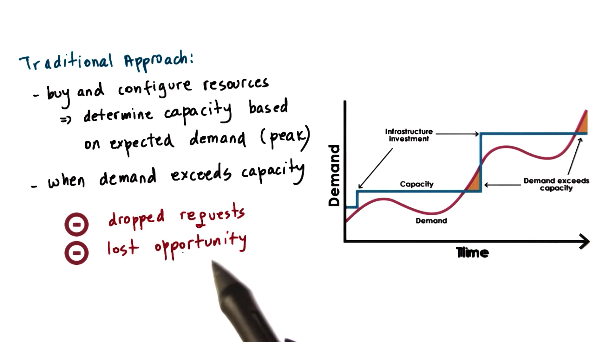
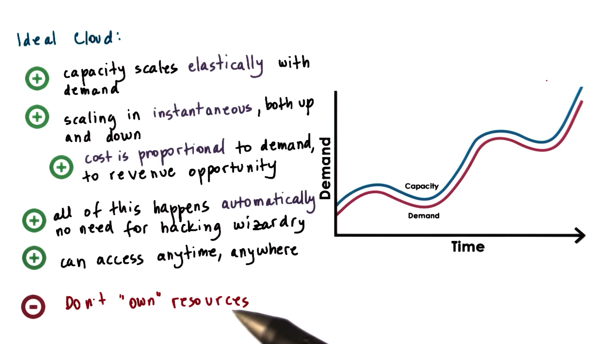
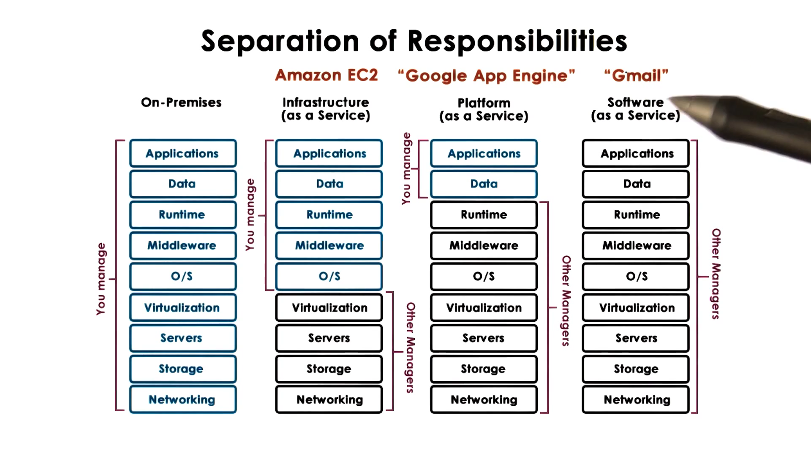
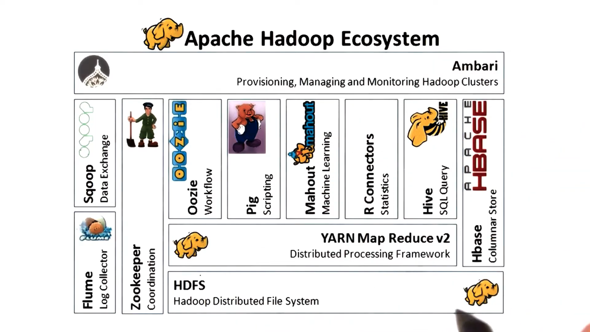
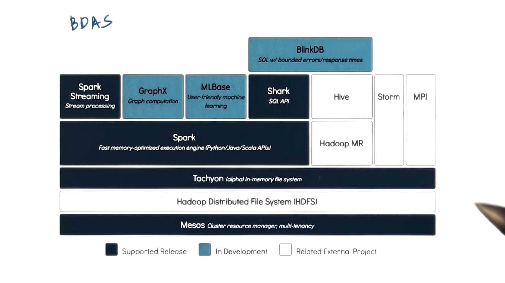

# Internet Services

Service that is accessible via a web interface

## Components

**Presentation** == static content related

**Business logic** == dynamic content

**Database tier** == data store

- No need to run as separate processes on separate machines

- Many available open source and proprietary technologies

- Multiprocess configurations will need to communicate via some form of IPC, including RPC/RHI, shared memory ...

### Middleware

Supporting, integrative or value-added software technologies

# Internet Service Architectures

- Scale out architecture

  For scale, we choose multi-rocess on multi-node

## Boss-worker

A front-end load-balancing component route the incoming request to an appropriate node

## Node Set Up

### Homogenous setup

**All Equal** - all nodes execute any possible step in the request processing, for any request

### Heterogenous setup

**Specialized Nodes** - nodes execute some specific steps in the request processing, for some request types

# Homogenous Architectures

Frontend behaves as the boss to push request to workers

## Benefits

Front-end (load balancer) can be kept very simple

It can assign requests in a round-robin manner to the next available node

Doesn't mean that every node has all of the data. Just very node can get to all data

## Downside

Can not benefit from caching

A simple front-end will not keep enough to understand the locality of each task on a node by node basis

# Heterogenous Architectures

Different nodes are designated to perform certain functions or handle certain types of requests

Data is not uniformly accessible everywhere

## Benefits

Benefit from caching and locality

## Downside

1. More complex front-end

2. More complex management

# Cloud Computing Poster Child: Animoto

## Amazon
- provisioned hardware resources for holiday sale season
- resources idle the rest of the year
- opened access to its resources via web-based APIs
- third party worklads on Amazon hardware, for a fee

This was the birth of **Amazon Web Services** (AWS) and **Amazon Elastic Cloud Compute** (EC2).

## Animoto

Rent EC2 instances instead of building out their own datacenter

Originally, Animoto required about 50 EC2 instances

In 2008, Animoto became available to Facebook users. Within three days, Animoto signed up 750,000 new users, and scaled up to 3,400 EC2 instances

Can not achieve this with traditional in-house deployment and provisioning tools

# Cloud Computing Requirements

## Traditional

## Ideally

## Summarized Requirement

- On-demand, elastic resources and services
- Fine-grained pricing based on usage
- Professionally managed and hosted
- API-based access

# Cloud Computing Overview

- Shared resources
  - infrastructure and software/services

- APIs for access and configuration
    - web-based, library-based, or command line-based

- billing / accounting services
  -  spot pricing, reservation pricing, or other pricing models

- Typically discrete quantities
   - tiny, medium, x-large

- All of this is managed by the cloud provider

# Why Does Cloud Computing Work?

Two basic principles provide the fundamental theory behind the cloud computing approach

## Law of large numbers

- Per customer there is a large variation in resource needs

- Average across many customers is roughly constant

## Economies of scale

Unit cost of provising resources or service drops at **bulk**

# Cloud Computing Vision

If computers of the kind I have advocated become the computers of the future, then computing may some day be organized as a public utility, just saw the telephone system is a public utility … The computer utility could become the basis of a new and important industry

**computing == fungible utility**

## Limitations

API lock0in, hardware dependence, latency, privary, security...

# Cloud Deployment Models

## Public

Third party customers/tenants can rent the hardware to perform their computational tasks

## Private

Leverage technology internally

## Hybrid

Private clouds comprise the main compute resources, with failover, dealing with spikes andload testing are being handled on public cloud resources

## Community

Public clouds used by certain types of users

# Cloud Service Models

Clouds are often differentiated based on the service model

# Requirements for the Cloud

## Fungible resources

Resources can easily be repurposed to support different customers with different types of requirements. Without fungibility, the economic opportunity for cloud providers disappears.

## Elastic, dynamic resource allocation methods

Clouds must integrate resource management methods that support the premise of cloud computing

## Scale

- Managemnent at scale

- Scalable resource allocations

## Deail with failures

Once scale is introduced, failures become inevitable

## Multi-tenancy

Guarantee performance and isolation across these multi-tenant environments.

##  Security

Guarantees safety of client's data and the security of the execution environment

# Cloud Enabling Technologies

## Virtualization

Provide fungible resources that can be dynamically repurposed for different customer needs

## resource-provisioning (Scheduling)

Cloud resources can be spun up quickly, consistently, and efficiently
  -  mesos,  yarn ...

## Big Data process

- Hadoop MapReduce
- Spark

### Data Storage

- Distributed filesystems - append only

- NoSQL databases and distributed in-memory caches

## Software

Cloud users need to be isolated from one another. Cloud computing technologies need software that can enable and configure these defined slices of resources.

## Monitoring

Real time log process

- Flume, CloudWatch

# The Cloud as a Big Data Engine

One benefit of cloud computing is that it empowers anyone to have potentially infinite resources

## Layers

- Data storage layer
- Data processing layer
- Caching layer
- Language front-end (query)
- Analytics libraries
- Continously streaming data

# Example Big Data Stacks

## Hadoop

## Berkeley Data Analytics Stack (BDAS)

