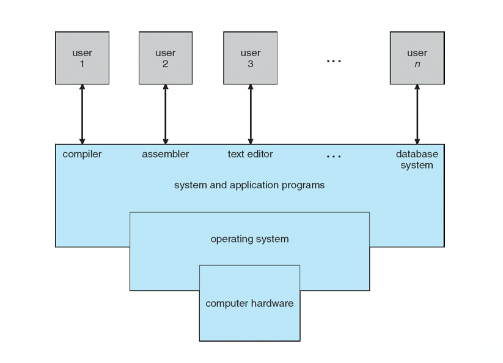
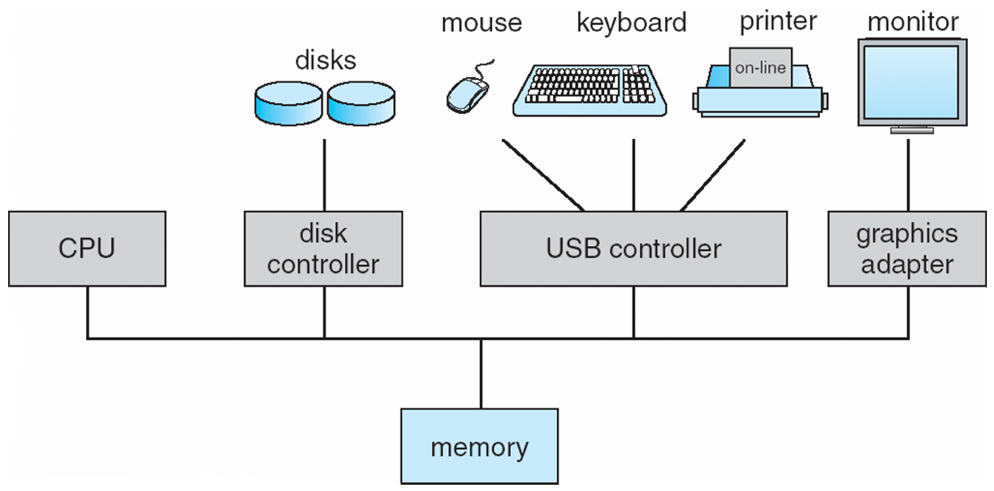
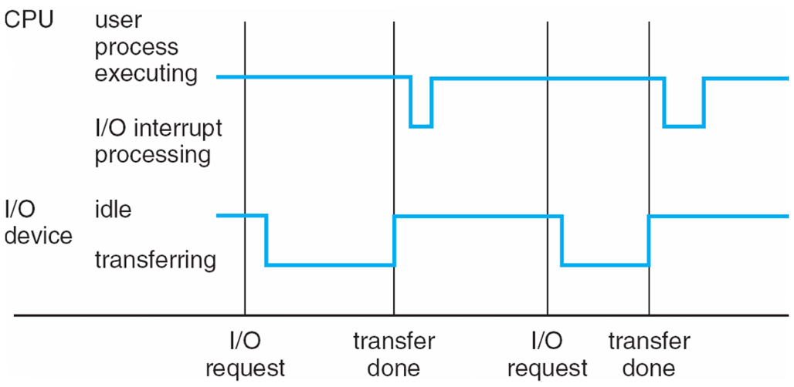

### What is an Operating System

A program that acts as an intermediary between a user of a computer and the computer hardware

### Operating system goals

- Execute user programs and make solving user problems easier
- Make the computer system convenient to use
- Use the computer hardware in an efficient manner

### Computer System Structure

Computer system can be divided into four components:

- Hardware – provides basic computing resources
  - CPU, memory, I/O devices
- Operating system
  - Controls and coordinates use of hardware among various applications and users
- Application programs – define the ways in which the system resources are used to solve the computing problems of the users
  - Word processors, compilers, web browsers, database systems, video games
- Users
  - People, machines, other computers

# What Operating Systems Do

- Depends on the point of view
- PC (**single-user**) want convenience, **ease of use** and **good performance**
  - Don’t care about **resource utilization** (How various hardware and software resources are shared).
- **mainframe** or **minicomputer** must keep all users happy. OS maximize resource utilization - to assure all available CPU time, memory, and I/O are used efficiently and no individual users takes more than her fail share.
- **workstations** users have dedicated resources but also share resources such as networking and servers. OS compromise between individual usability and resource utilization.
- Handheld computers are resource poor, optimized for usability and battery life
- Some computers have little or no user interface, such as embedded computers in devices and automobiles

## Operating System Definition

- No universally accepted definition
- “Everything a vendor ships when you order an operating system” is a good approximation
  - But varies wildly
- “The one program running at all times on the computer” is the kernel.
- Everything else is either
  - a system program (ships with the operating system) , or
  - an application program.
- Mobile operationg systems often include core kernel and **middleware** - a set of software frameworkds providing additional services to application developers

### OS is a **resource allocator**

- Manages all resources
- Decides between conflicting requests for efficient and fair resource use

### OS is a **control program**

- Controls execution of programs to prevent errors and improper use of the computer

# Computer System Organization

## Computer-system operation

- One or more CPUs, device controllers connect through common bus providing access to shared memory
- Concurrent execution of CPUs and devices competing for memory cycles

I/O devices and the CPU can execute concurrently

Each device controller is in charge of a particular device type

Each device controller has a local buffer
CPU moves data from/to main memory to/from local buffers

I/O is from the device to local buffer of controller

Device controller informs CPU that it has finished its operation by causing an interrupt

### Computer Startup

**bootstrap program** is loaded at power-up or reboot

- Typically stored in ROM or EPROM, generally known as **firmware**
- Initializes all aspects of system (CPU registers, device controllers, memory contents, etc.)
- Locate operating-system kernel, load it into memory and execute it
- **System processes / system daemons** (run the entire time the kernel is running) are loaded into memory at boot time and privide services out of the kernel
- The system is then fully booted and the system waits for some event to occur

### Interrupts

The occurance of an event is usually signaled by an interrupt from either the hardware or the software.

#### hardware

sending a signal to the CPU by the way of the system bus

#### software

executing a special operation called a **system call (monitor call)**

#### When CPU interrupted

1. Cpu stops and transfers executuins to a **fixed location** (contains the starting address whether the service routine for the interrupt is located)

2. interrupt service routine executes

3. CPU resumes the interrupted computation.

#### Common Functions of Interrupts

- Interrupt transfers control to the interrupt service routine generally, through the **interrupt vector**, which contains the addresses of all the service routines

- Interrupt architecture must save the address of the interrupted instruction

- A trap or exception is a software-generated interrupt caused either by an error or a user request

- An operating system is interrupt driven

#### Interrupt Handling

The operating system preserves the state of the CPU by storing registers and the program counter

Determines which type of interrupt has occurred:

- polling
- vectored interrupt system

Separate segments of code determine what action should be taken for each type of interrupt 
 

## Storage Structure

### Main memory

- CPU can laod instructions **only** from memory

- General-purpose computers run most from **rewriteble memory** (**main mamory** / **random-access memory**/ **RAM**)

- commonly implemented in **DRAM** (dynamic random-access memory)

#### instructions

##### Load

moves a byte or word from main memory to an internal register within CPU

##### store

moves the content of a register to main memory

#### Cannot resides programs and data in main memory permanenty

1. too small to store all

2. **volatile** storage device that loses its contents when power is tuerned off or otherwise lost 
    

### Secondary storage

- extension of main memory
- provides large **nonvolatile** storage capacity
- most common device - **magnetic disk**

### Solid-state disk

- faster than magnetic disks, nonvolatile

### Storage Hierarchy

Storage systems organized in hierarchy

- Speed
- Cost
- Volatility

  
 

# Computer-System Architecture
