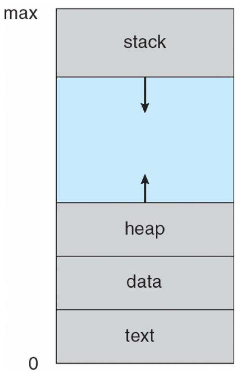
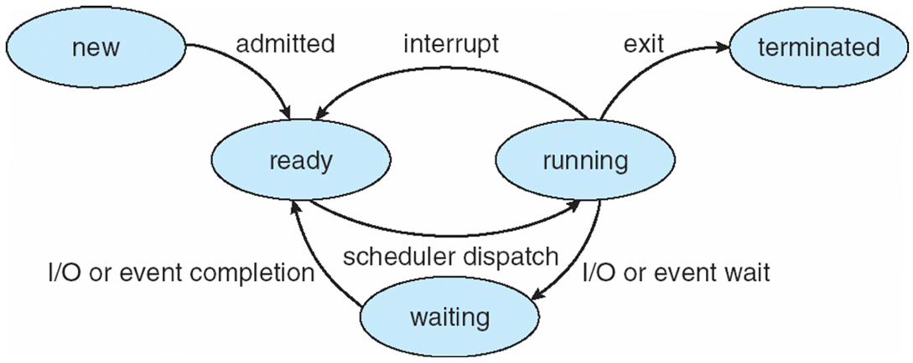
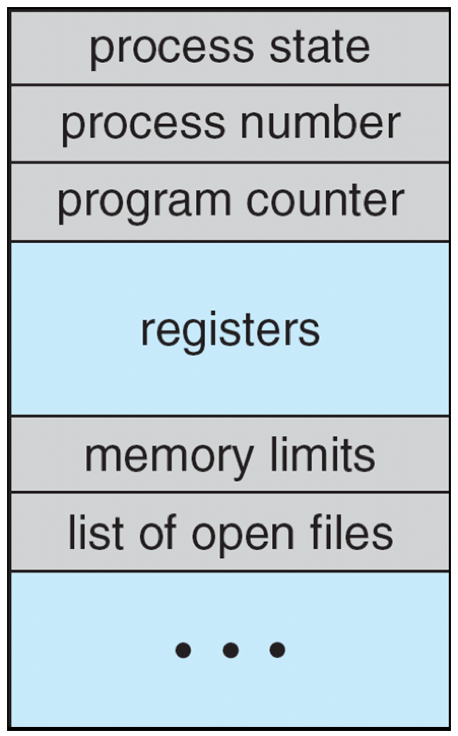
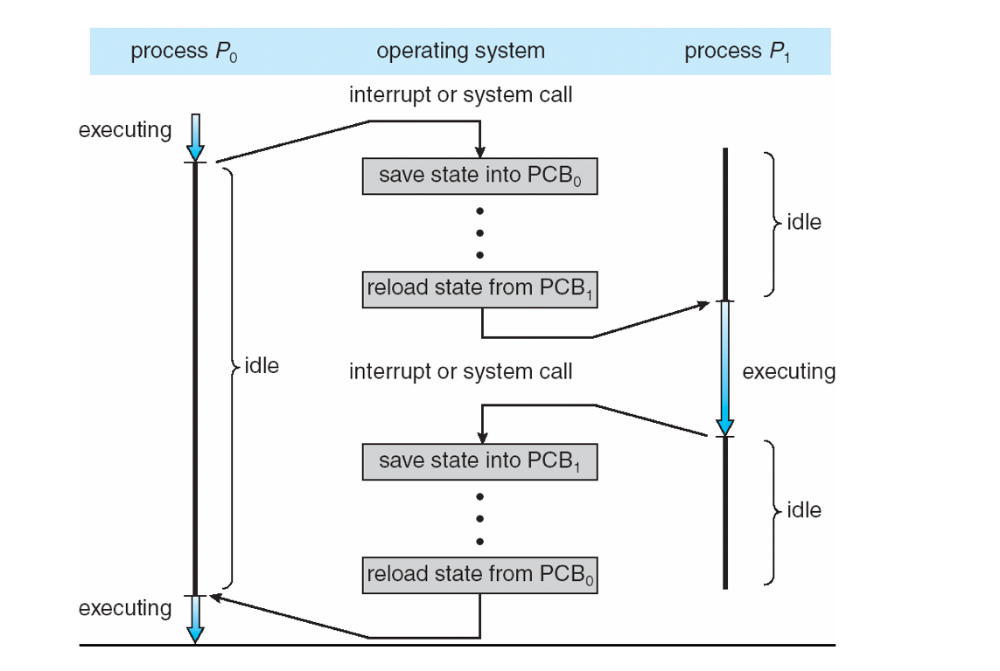
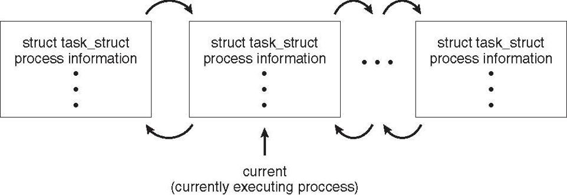
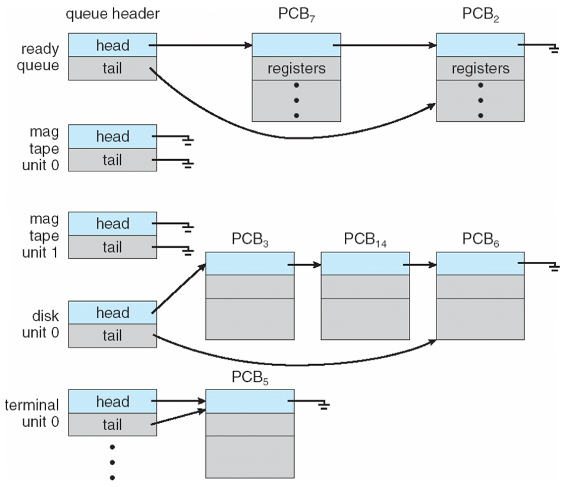
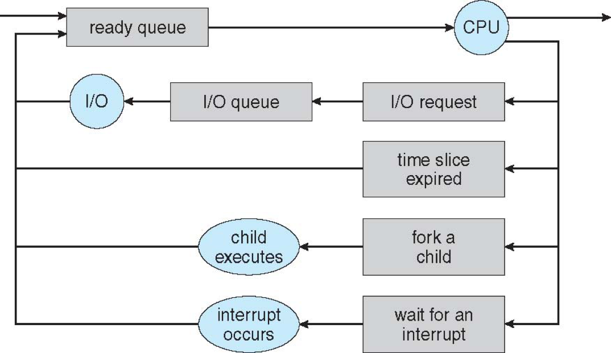
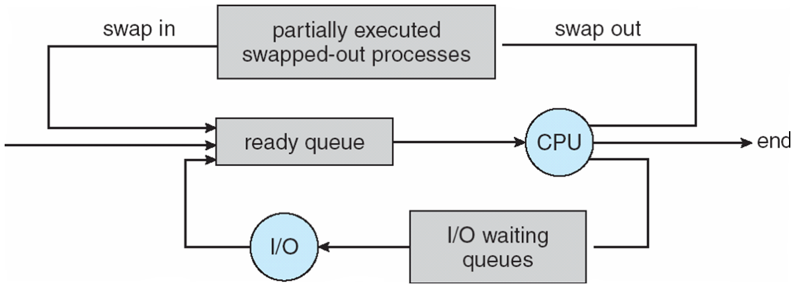
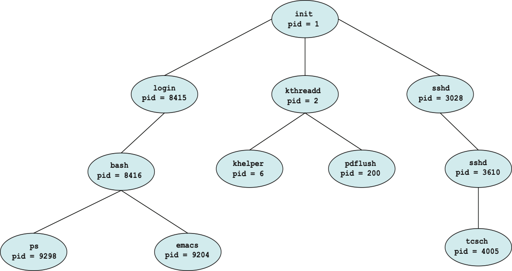
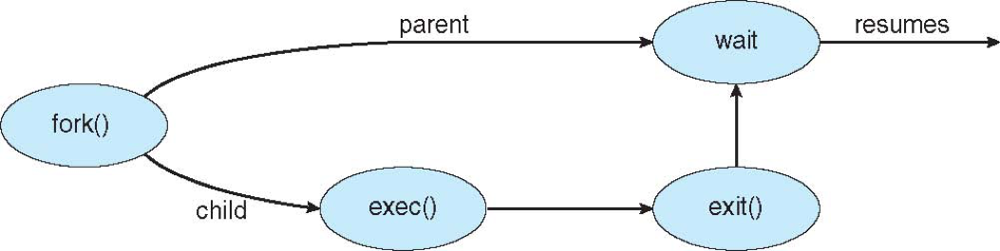

A process is the unit of work in a modern time-sharing system

# Process Concept

An operating system executes a variety of programs

- batch system - **jobs**
- Time-sharing systems - **user programs** or **tasks**
- **job** and **process** almost interchangeably in this text

## The Process

process - a program in execution



### multiple parts

- **text section** - the program code
- Current activity including **program counter**, processor registers
- **Stack** containing temporary data
  - Function parameters, return addresses, local variables
- **Data section** containing global variables
- **Heap** containing memory dynamically allocated during run time

### Program VS Process

Program is **passive** entity stored on disk (executable file), process is **active**

Program becomes process when executable file loaded into memory

Execution of program started via GUI mouse clicks, command line entry of its name, etc

One program can be several processes

- Consider multiple users executing the same program

A process can be an execution environment for other code

- JVM

## Process State

As a process executes, it changes state

- new: The process is being created
- running: Instructions are being executed
- waiting: The process is waiting for some event to occur
- ready: The process is waiting to be assigned to a processor
- terminated: The process has finished execution


<br>

## Process Control Block



Information associated with each process

- Process state – running, waiting, etc
- Program counter – location of next instruction to be executed
- CPU registers – contents of all process-centric registers
- CPU scheduling information - priorities, scheduling queue pointers
- Memory-management information – memory allocated to the process
- Accounting information – CPU used, clock time elapsed since start, time limits
- I/O status information – I/O devices allocated to process, list of open files


<br>

## Threads

Modern operating systems have extended the process concept to allow a process to have multiple threads of execution and thus to perfrom more than one task at a time.

PCB also include information for each thread

## Process Representation in Linux

```c
pid t_pid; /* process identifier */
long state; /* state of the process */
unsigned int time_slice /* scheduling information */
struct task_struct *parent; /* this process’s parent */
struct list_head children; /* this process’s children */
struct files_struct *files; /* list of open files */
struct mm_struct *mm; /* address space of this process */
```

Within the Linux kernel, all active processes are represented using a doubly linked list of task_struct.


<br>

# Process Scheduling

Maximize CPU use, quickly switch processes onto CPU for time sharing

**Process scheduler** selects among available processes for next execution on CPU

### scheduling queues

**Job queue** - set of all processes in the system

**Ready queue** - set of all processes residing in main memory, ready and waiting to execute

- Stored as linkedList

**Device queues** - set of processes waiting for an I/O device. Each device has its own device queue <br>



### Queueing diagram



- Rectangle box - queues
- Circle - resources that serve the queues
- Arrows - the flow of processes

A new process is initially put in the ready queue. It waits there until it is selected for execution, or **dispatched**. Once the process is allocated the CPU nad is executing, one of several events could occur:

- The process could issue an I/O request and then be placed in an I/O queue.
- The process could create a new child process and wait for the child's termination
- The process could be removed forcibly from the CPU, as a result of an interrupt, and be put back in the ready queue.

## Schedulers

Carry out selection process

### short-term scheduler (CPU scheduler)

Select which process should be executed next and allocates CPU

- Sometimes the only scheduler in a system
- short-term scheduler is invoked frequently (milliseconds) -> must be fast

### long-term scheduler (job scheduler)

Select which processes should be brought into the ready queue

- invoked infrequently (seconds, minutes)  (may be slow)
- controls the degree of multiprogramming (# of processes in memory)

### Processes can be described as either

- I/O-bound process

  - spends more time doing I/O than computations, many short CPU bursts

- CPU-bound process
  - spends more time doing computations; few very long CPU bursts

Long-term scheduler strives for good process mix

### Addition of Medium Term Scheduling

can be added if degree of multiple programming needs to decrease

#### Swapping

Remove process from memory, store on disk, bring back in from disk to continue execution



## Context Switch

When CPU switches to another process, the system must **save the state** of the old process and load the **saved state** for the new process via a **context switch**

**Context** of a process represented in the PCB

Context-switch time is overhead; the system does no useful work while switching

- The more complex the OS and the PCB the longer the context switch

Time dependent on hardware support

- Some hardware provides multiple sets of registers per CPU multiple contexts loaded at once

# Operations on Processes

### System must provide mechanisms for

- process creation,
- process termination,
- and so on as detailed next

## Process Creation

**Parent** process create **children** processes, which, in turn create other processes, forming a **tree** of processes

Process identified and managed via **process identifier (pid)**



### child process obtain resources

1. directly from operation system
2. constrained to a subset of the resources of parent

### Parent execution possibilities

1. parent continues to execute concurrently with its children
2. parent waits until some or all children have terminated

### address-space possibilities for the new process

1. child process is a duplicate of the parent process (has the same program and data as the parent)
2. child process has a new program loaded into it

### UNIX examples

fork() system call creates new process

- pid for parent process is an postive integer, for child process is zero

- run the same codeinstructions, has own copy of any data

exec() system call used after a fork() to replace the process’ memory space with a new program

- load a binary file into memory (destroyig the memory image of the program containing the exec() system call) and start its execution
  <br>


<br>

## Process Termination

Process executes last statement and then asks the operating system to delete it using the exit() system call.

- Returns status data from child to parent (via wait())

- Process’ resources are deallocated by operating system

Parent may terminate the execution of children processes using the abort() system call. Some reasons for doing so:

- Child has exceeded allocated resources
- Task assigned to child is no longer required
- The parent is exiting and the operating systems does not allow a child to continue if its parent terminates

### Cascading termination

Some operating systems do not allow child to exists if its parent has terminated. If a process terminates, then all its children must also be terminated

Is initiated by the operating system

The parent process may wait for termination of a child process by using the wait()system call. The call returns status information and the pid of the terminated process

```c
pid = wait(&status);
```

### zombie process

no parent waiting (did not invoke wait()) process

### orphan process

Parent terminated without invoking wait

- Assign the init process as the new parent

# Interprocess Communication

# Examples of IPC Systems

# Communications in Client-Server Systems
