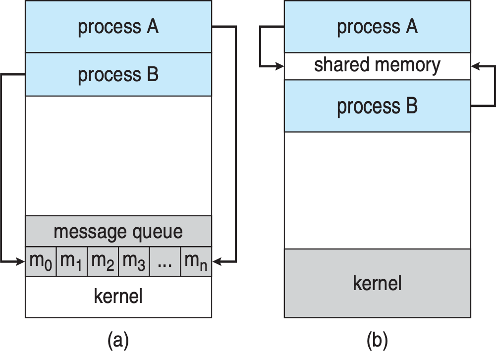
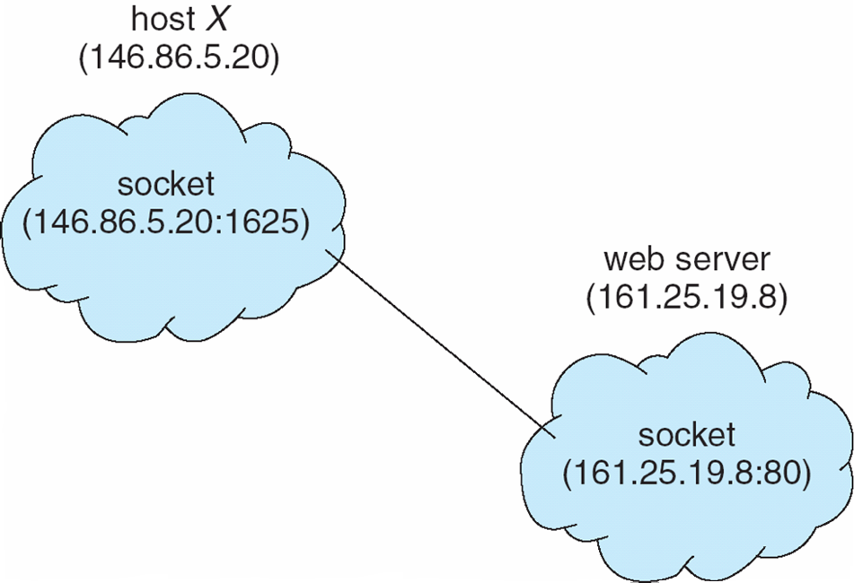
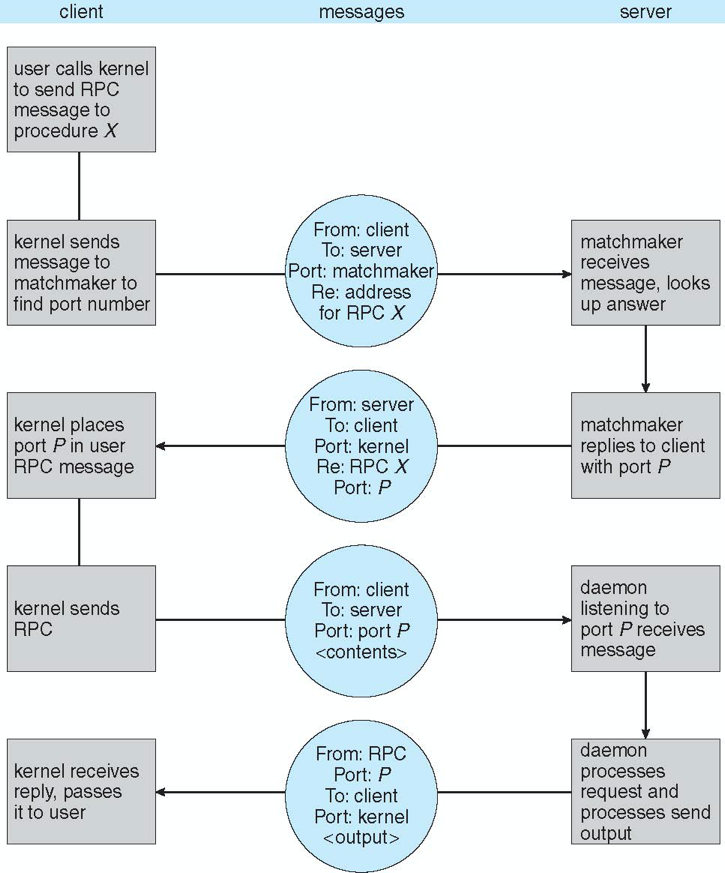
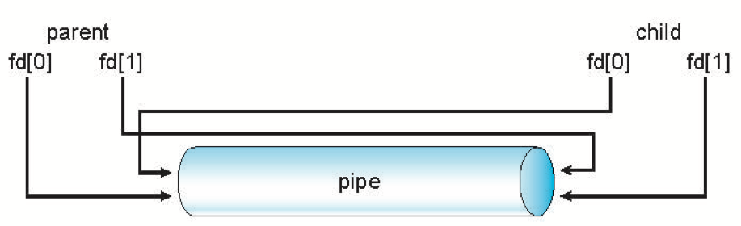

A process is the unit of work in a modern time-sharing system

# Process Concept

An operating system executes a variety of programs

- batch system - **jobs**
- Time-sharing systems - **user programs** or **tasks**
- **job** and **process** almost interchangeably in this text

## The Process

process - a program in execution


### multiple parts

- **text section** - the program code
- Current activity including **program counter**, processor registers
- **Stack** containing temporary data
  - Function parameters, return addresses, local variables
- **Data section** containing global variables
- **Heap** containing memory dynamically allocated during run time

### Program VS Process

Program is **passive** entity stored on disk (executable file), process is **active**

Program becomes process when executable file loaded into memory

Execution of program started via GUI mouse clicks, command line entry of its name, etc

One program can be several processes

- Consider multiple users executing the same program

A process can be an execution environment for other code

- JVM

## Process State

As a process executes, it changes state

- new: The process is being created
- running: Instructions are being executed
- waiting: The process is waiting for some event to occur
- ready: The process is waiting to be assigned to a processor
- terminated: The process has finished execution


<br>

## Process Control Block


Information associated with each process

- Process state – running, waiting, etc
- Program counter – location of next instruction to be executed
- CPU registers – contents of all process-centric registers
- CPU scheduling information - priorities, scheduling queue pointers
- Memory-management information – memory allocated to the process
- Accounting information – CPU used, clock time elapsed since start, time limits
- I/O status information – I/O devices allocated to process, list of open files


<br>

## Threads

Modern operating systems have extended the process concept to allow a process to have multiple threads of execution and thus to perfrom more than one task at a time.

PCB also include information for each thread

## Process Representation in Linux

```c
pid t_pid; /* process identifier */
long state; /* state of the process */
unsigned int time_slice /* scheduling information */
struct task_struct *parent; /* this process’s parent */
struct list_head children; /* this process’s children */
struct files_struct *files; /* list of open files */
struct mm_struct *mm; /* address space of this process */
```

Within the Linux kernel, all active processes are represented using a doubly linked list of task_struct.


<br>

# Process Scheduling

Maximize CPU use, quickly switch processes onto CPU for time sharing

**Process scheduler** selects among available processes for next execution on CPU

### scheduling queues

**Job queue** - set of all processes in the system

**Ready queue** - set of all processes residing in main memory, ready and waiting to execute

- Stored as linkedList

**Device queues** - set of processes waiting for an I/O device. Each device has its own device queue <br>


### Queueing diagram


- Rectangle box - queues
- Circle - resources that serve the queues
- Arrows - the flow of processes

A new process is initially put in the ready queue. It waits there until it is selected for execution, or **dispatched**. Once the process is allocated the CPU nad is executing, one of several events could occur:

- The process could issue an I/O request and then be placed in an I/O queue.
- The process could create a new child process and wait for the child's termination
- The process could be removed forcibly from the CPU, as a result of an interrupt, and be put back in the ready queue.

## Schedulers

Carry out selection process

### short-term scheduler (CPU scheduler)

Select which process should be executed next and allocates CPU

- Sometimes the only scheduler in a system
- short-term scheduler is invoked frequently (milliseconds) -> must be fast

### long-term scheduler (job scheduler)

Select which processes should be brought into the ready queue

- invoked infrequently (seconds, minutes)  (may be slow)
- controls the degree of multiprogramming (# of processes in memory)

### Processes can be described as either

- I/O-bound process

  - spends more time doing I/O than computations, many short CPU bursts

- CPU-bound process
  - spends more time doing computations; few very long CPU bursts

Long-term scheduler strives for good process mix

### Addition of Medium Term Scheduling

can be added if degree of multiple programming needs to decrease

#### Swapping

Remove process from memory, store on disk, bring back in from disk to continue execution


## Context Switch

When CPU switches to another process, the system must **save the state** of the old process and load the **saved state** for the new process via a **context switch**

**Context** of a process represented in the PCB

Context-switch time is overhead; the system does no useful work while switching

- The more complex the OS and the PCB the longer the context switch

Time dependent on hardware support

- Some hardware provides multiple sets of registers per CPU multiple contexts loaded at once

# Operations on Processes

### System must provide mechanisms for

- process creation,
- process termination,
- and so on as detailed next

## Process Creation

**Parent** process create **children** processes, which, in turn create other processes, forming a **tree** of processes

Process identified and managed via **process identifier (pid)**


### child process obtain resources

1. directly from operation system
2. constrained to a subset of the resources of parent

### Parent execution possibilities

1. parent continues to execute concurrently with its children
2. parent waits until some or all children have terminated

### address-space possibilities for the new process

1. child process is a duplicate of the parent process (has the same program and data as the parent)
2. child process has a new program loaded into it

### UNIX examples

fork() system call creates new process

- pid for parent process is an postive integer, for child process is zero

- run the same codeinstructions, has own copy of any data

exec() system call used after a fork() to replace the process’ memory space with a new program

- load a binary file into memory (destroyig the memory image of the program containing the exec() system call) and start its execution
  <br>


<br>

## Process Termination

Process executes last statement and then asks the operating system to delete it using the exit() system call.

- Returns status data from child to parent (via wait())

- Process’ resources are deallocated by operating system

Parent may terminate the execution of children processes using the abort() system call. Some reasons for doing so:

- Child has exceeded allocated resources
- Task assigned to child is no longer required
- The parent is exiting and the operating systems does not allow a child to continue if its parent terminates

### Cascading termination

Some operating systems do not allow child to exists if its parent has terminated. If a process terminates, then all its children must also be terminated

Is initiated by the operating system

The parent process may wait for termination of a child process by using the wait()system call. The call returns status information and the pid of the terminated process

```c
pid = wait(&status);
```

### zombie process

no parent waiting (did not invoke wait()) process

### orphan process

Parent terminated without invoking wait

- Assign the init process as the new parent

# Interprocess Communication

Processes within a system may be

- independent - cannot affect or be affected by the other processes executing, share no data

- cooperating - can affect or be affected by the other processes executing, share data

### Reasons for cooperating processes

1. information sharing
2. Computation speedup
3. Modularity

### Interprocess communication (IPC)

Allow cooperating processes to exchange data and information

#### two models

- Shared memory

- Message passing


<br>

## Shared-Memory Systems

Requires communicating processes to establish a region of shared memory

Resides in the address space of the process creaing the shared-memory segment

Other processes need to attach the sahred-memory to their address space

All agree to remove restriction on preventing other processing from accessing memory

processes need to ensure not wring to the same location simultaneously

### Producer-Consumer Problem

Paradigm for cooperating processes, producer process produces information that is consumed by a consumer process

A (shared) buffer can be filled by the producer and emptied by the consumer

Must be synchronized so comsumer does not consume an item has not yet been produced (main issue)

#### Two types of buffers

**unbounded-buffer**

places no practical limit on the size of the buffer

**bounded-buffer**

a fixed buffer size

```c
#define BUFFER_SIZE 10
typedef struct {
	. . .
} item;
/* circular array with two logical pointer: in and out */
item buffer[BUFFER_SIZE];
int in = 0;
int out = 0;
```

**Empty buffer**: in == out

**full buffer**: ((in + 1) % BUFFER_SIZE) == out

#### Producer

```c
item next_produced;
while (true) {
	/* produce an item in next produced */
	while (((in + 1) % BUFFER_SIZE) == out)
		; /* do nothing */
	buffer[in] = next_produced;
	in = (in + 1) % BUFFER_SIZE;
}
```

#### Consumer

```c
item next_consumed;
while (true) {
    while (in == out)
		; /* do nothing */
    next_consumed = buffer[out];
	out = (out + 1) % BUFFER_SIZE;
	/* consume the item in next consumed */
}
```

## Message_Passing Systems

Processes communicate with each other without resorting to shared variables

Useful in distributed environment

The message size is either fixed or variable

If processes P and Q wish to communicate, they need to:

- Establish a **communication link** between them
- Exchange messages via send/receive

### Implementation of communication link

Physical

- Shared memory
- Hardware bus
- Network

Logical

- Direct or indirect
- Synchronous or asynchronous
- Automatic or explicit buffering

### Naming

#### Direct Communication

- Processes must name each other explicitly
  - **send** (_P, message_) – send a message to process P
  - **receive**(_Q, message_) – receive a message from process Q

Properties of communication link

- Links are established automatically
- A link is associated with exactly one pair of communicating processes
- Between each pair there exists exactly one link

#### Indirect Communication

Messages are directed and received from mailboxes (also referred to as ports)

Each mailbox has a unique id

Processes can communicate only if they share a mailbox

- **send** (_P, message_) – send a message to process P
- **receive**(_id, message_) – receive a message from any process. The variable id is the name of process the communication has taken place

##### Properties of communication link

- Link established only if processes share a common mailbox
- A link may be associated with many processes
- Each pair of processes may share several communication links
  <br>

##### Operations

- create a new mailbox (port)
- send and receive messages through mailbox
- destroy a mailbox

Primitives are defined as:

- **send**(A, message) – send a message to mailbox A
- **receive**(A, message) – receive a message from mailbox A

# Examples of IPC Systems

# Communications in Client-Server Systems

### Three strategies for communication in client-server systems

- socket
- remote procedure calls (RPCs)
- pipes

## Sockets

A socket is defined as an endpoint for communication

It's a low level form of communication

Concatenation of IP address and port – a number included at start of message packet to differentiate network services on a host

The socket **161.25.19.8:1625** refers to port **1625** on host **161.25.19.8**

Communication consists between a pair of sockets



All ports below 1024 are well known, used for standard services

Special IP address 127.0.0.1 (loopback) to refer to system on which process is running (itself)

### Sockets in Java

Three types of sockets

- Connection-oriented (**TCP**)
- Connectionless (**UDP**)
- **MulticastSocket** class– data can be sent to multiple recipients
  <br>

#### Server

```java
public class DateServer {
    public static void main(String[] args) {
        try {
            ServerSocket sock = new ServerSocket(6013);

            /* now listen for connections */
            while (true) {
                // return a socket server can use to communicate with client
                Socket client = sock.accept();

                PrintWriter oout = new PrintWeiter(client.getOutputStream(), true);

                // write the fate to the socket
                pout.println(new java.util.Date().toString());

                // close the socket and resume listeing for connection
                client.close();
            }
        } catch (IOExection ioe) {
            System.err.println(ioe);
        }
    }
}
```

<br>

#### Client

```java
public class DateClient {
    public static void main(String[] args) {
        try {
            // make connection to server socket
            Socket sock = new Socket("127.0.0.1", 6013);
            InputStream in = sock.getInputStream();
            BufferReader bin = new BufferedReader(new InputStreamReader(in));

            // read the date from the socket
            string line;
            while ( (line = bin.readLine()) != null) {
                System.out.println(line);
            }

            // close the socket connection
            sock.close();
        } catch (IOExection ioe) {
            System.err.println(ioe);
        }
    }
}
```

<br>

## Remote Procedure Calls

Remote procedure call (RPC) abstracts procedure calls between processes on networked systems

- Again uses ports for service differentiation

The semantics of RPCs allows a client to invoke a procedure on a remote host as it would invoke a procedure locally

### stub

client-side proxy for the actual procedure on the server

A seperate stub exists for each separate remote procedure

### Steps

1. client invokes a remote procedure
2. RPC syste, calls the appropriate stub, passing it the parameters provided to the remote procedure
3. The client-side stub **locates** the server and **marshalls** the parameters

   - marshalls: package the parameters into a form can be transmitted over a network

4. The client-side stub transmits a message to the server using message passing

5. The server-side stub receives this message, unpacks the marshalled parameters, and performs the procedure on the server
6. return value in same technique
   <br>

### Issues

1. Differences in data representation on the client and server machines

   Define a machine-independent representation of data - **External Data Representation (XDL)**

2. Remote communication has more failure scenarios than local

   OS ensures messages can be delivered **exactly once** rather than at most once

   - enter repeated messages are detected and ignored

     Attach a timestamp to each messsage, the server keep history of message already processed

   - remove risk that the server never receives the request

     server acknowledge to the client that the RPC call was received and executed, or client keep resending

3. Communication between server and client

   To know which procudure to execute, RPC scheme requires a binding of client and server port, but client have no idea since they don't share memory

   Two way to solve it:

   1> bingding information is predetermined in fixes port address

   2> rendezvous (or matchmaker) service

   Require extra overhead of the initial request but more flexible

   
   <br>

## Pipes

Acts as a conduit allowing two processes to communicate

### Issues

- Is communication unidirectional or bidirectional?

- In the case of two-way communication, is it half or full-duplex?

- Must there exist a relationship (i.e., parent-child) between the communicating processes?

- Can the pipes be used over a network?

### Ordinary Pipes

Ordinary Pipes allow communication in standard producer-consumer style

Producer writes to one end (the write-end of the pipe)

Consumer reads from the other end (the read-end of the pipe)

Ordinary pipes are therefore unidirectional

Require parent-child relationship between communicating processes



```c
#include <sys/types.h>
#include <stdio.h>
#include <string.h>
#include <unistd.h>
#define BUFFER SIZE 25
#define READ END 0
#define WRITE END 1
int main(void)
{
    char write msg[BUFFER SIZE] = "Greetings";
    char read msg[BUFFER SIZE];
    int fd[2];
    pid t pid;

    /* create the pipe */
    if (pipe(fd) == -1) {
        fprintf(stderr,"Pipe failed");
        return 1;
    }

    /* fork a child process */
    pid = fork();

    if (pid < 0) { /* error occurred */
        fprintf(stderr, "Fork Failed");
        return 1;
    }

    if (pid > 0) { /* parent process */
        /* close the unused end of the pipe */
        close(fd[READ END]);

        /* write to the pipe */
        write(fd[WRITE END], write msg, strlen(write msg)+1);

        /* close the write end of the pipe */
        close(fd[WRITE END]);
    }
    else { /* child process */
        /* close the unused end of the pipe */
        close(fd[WRITE END]);
        /* read from the pipe */
        read(fd[READ END], read msg, BUFFER SIZE);
        printf("read %s",read msg);
        /* close the write end of the pipe */
        close(fd[READ END]);
    }

    return 0;
}
```

<br>

### Named Pipes

Named Pipes are more powerful than ordinary pipes

Communication is bidirectional

No parent-child relationship is necessary between the communicating processes

Several processes can use the named pipe for communication

Provided on both UNIX and Windows systems
