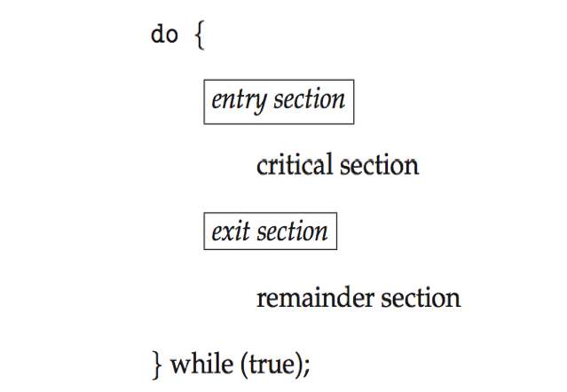
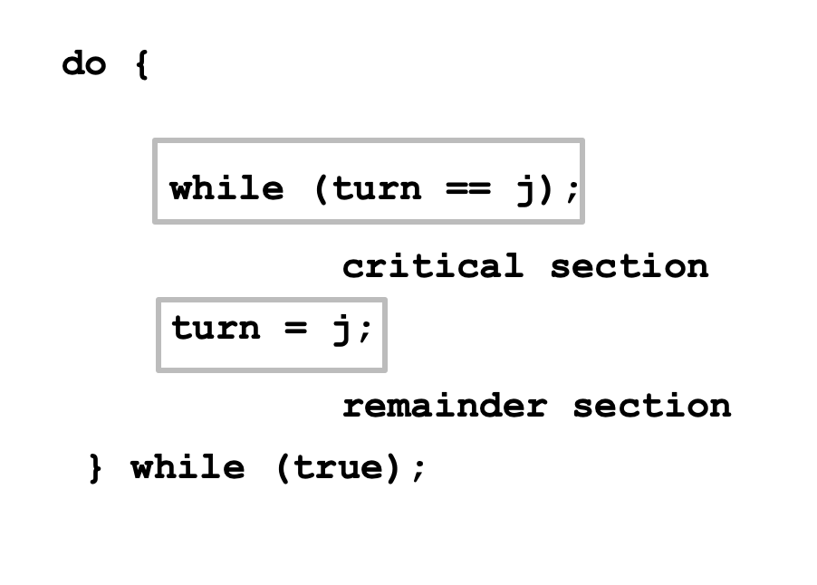
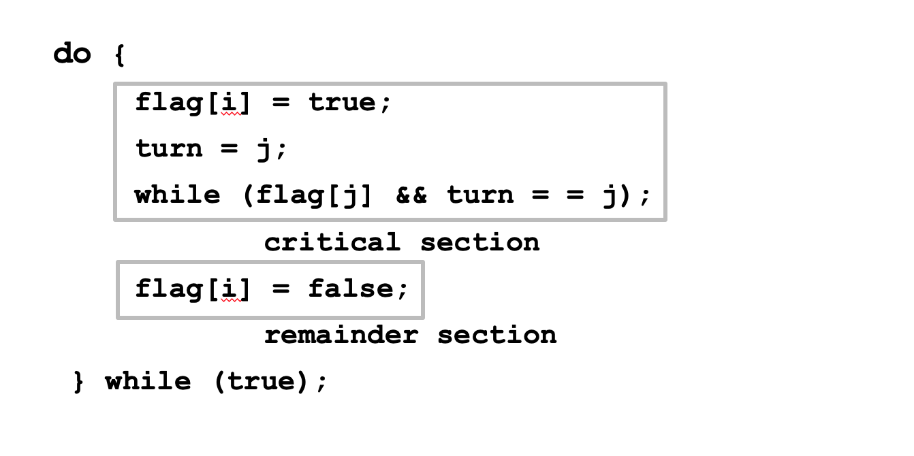

# Background

Processes can execute concurrently

- May be interrupted at any time, partially completing execution

Concurrent access to shared data may result in data inconsistency

Maintaining data consistency requires mechanisms to ensure the orderly execution of cooperating processes

## Illustration of the problem

Suppose that we wanted to provide a solution to the consumer-producer problem that fills all the buffers (**bounded buffer**). We can do so by having an integer counter that keeps track of the number of full buffers.

Initially, counter is set to 0. It is incremented by the producer after it produces a new buffer and is decremented by the consumer after it consumes a buffer.

## Producer

```c
while (true) {	/* produce an item in next produced */

	while (counter == BUFFER_SIZE) ;
		/* do nothing */
	buffer[in] = next_produced;
	in = (in + 1) % BUFFER_SIZE;
	counter++;
}
```

## Consumer

```c
while (true) {
	while (counter == 0)
		; /* do nothing */
	next_consumed = buffer[out];
	out = (out + 1) % BUFFER_SIZE;
        counter--;
	/* consume the item in next consumed */
}
```

#### Above producer and consumer may not funtion correctly when executed concurrently

<br>

## Race Condition

Several processes access and manipulate the same data concurrently and the outcome of the execution depends on particular order in which the access take place
<br>

### counter++ could be implemented as

```c
register1 = counter
register1 = register1 + 1
counter = register1
```

### counter-- could be implemented as

```c
register2 = counter
register2 = register2 - 1
counter = register2
```

### One interleaving example

S0: producer execute register1 = counter (register1 = 5)

S1: producer execute register1 = register1 + 1 (register1 = 6)

S2: consumer execute register2 = counter (register2 = 5)

S3: consumer execute register2 = register2 – 1 (register2 = 4)

S4: producer execute counter = register1 (counter = 6)

S5: consumer execute counter = register2 (counter = 4)
<br>
<br>

# The Critical-Section Problem

Consider system of n processes {_p0, p1, … pn-1_}

Each process has **critical section** segment of code

- Process may be changing common variables, updating table, writing file, etc
- When one process in critical section, no other may be in its critical section

**Critical section problem** is to design protocol to solve this

Each process must ask permission to enter critical section in **entry section**, may follow critical section with **exit section**, then **remainder section**



## Algorithm for Process Pi



## Solution Requirements

1.  **Mutual Exclusion**

    If process Pi is executing in its critical section, then no other processes can be executing in their critical sections

2.  **Progress**

    If no process is executing in its critical section and there exist some processes that wish to enter their critical section, then the selection of the processes that will enter the critical section next cannot be postponed indefinitely

3.  **Bounded Waiting**

    A bound must exist on the number of times that other processes are allowed to enter their critical sections after a process has made a request to enter its critical section and before that request is granted

    - Assume that each process executes at a nonzero speed

    - No assumption concerning relative speed of the n processes

## Critical-Section Handling in OS

Two approaches depending on if kernel is **preemptive** or **non-preemptive**

**Preemptive** – allows preemption of process when running in kernel mode

**Non-preemptive** – runs until exits kernel mode, blocks, or voluntarily yields CPU

- Essentially free of race conditions in kernel mode

<br>
<br>

# Peterson’s Solution

Good algorithmic description of solving the problem

Two process solution

#### The two processes share two variables

```c
int turn;
Boolean flag[2]
```

**turn** - whose turn to enter the critical section

**flag array** - if a process is ready to enter the critical section. flag[i] = true implies that process Pi is ready



Provable that the three CS requirement are met:

1.  Mutual exclusion is preserved
    Pi enters CS only if:
    either flag[j] = false or turn = i
2.  Progress requirement is satisfied
3.  Bounded-waiting requirement is met
