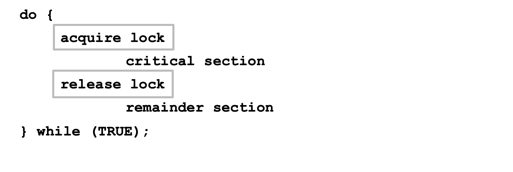

# Background

Processes can execute concurrently

- May be interrupted at any time, partially completing execution

Concurrent access to shared data may result in data inconsistency

Maintaining data consistency requires mechanisms to ensure the orderly execution of cooperating processes

## Illustration of the problem

Suppose that we wanted to provide a solution to the consumer-producer problem that fills all the buffers (**bounded buffer**). We can do so by having an integer counter that keeps track of the number of full buffers.

Initially, counter is set to 0. It is incremented by the producer after it produces a new buffer and is decremented by the consumer after it consumes a buffer.

## Producer

```c
while (true) {	/* produce an item in next produced */

	while (counter == BUFFER_SIZE) ;
		/* do nothing */
	buffer[in] = next_produced;
	in = (in + 1) % BUFFER_SIZE;
	counter++;
}
```

## Consumer

```c
while (true) {
	while (counter == 0)
		; /* do nothing */
	next_consumed = buffer[out];
	out = (out + 1) % BUFFER_SIZE;
        counter--;
	/* consume the item in next consumed */
}
```

#### Above producer and consumer may not funtion correctly when executed concurrently

<br>

## Race Condition

Several processes access and manipulate the same data concurrently and the outcome of the execution depends on particular order in which the access take place
<br>

### counter++ could be implemented as

```c
register1 = counter
register1 = register1 + 1
counter = register1
```

### counter-- could be implemented as

```c
register2 = counter
register2 = register2 - 1
counter = register2
```

### One interleaving example

S0: producer execute register1 = counter (register1 = 5)

S1: producer execute register1 = register1 + 1 (register1 = 6)

S2: consumer execute register2 = counter (register2 = 5)

S3: consumer execute register2 = register2 – 1 (register2 = 4)

S4: producer execute counter = register1 (counter = 6)

S5: consumer execute counter = register2 (counter = 4)
<br>
<br>

# The Critical-Section Problem

Consider system of n processes {_p0, p1, … pn-1_}

Each process has **critical section** segment of code

- Process may be changing common variables, updating table, writing file, etc
- When one process in critical section, no other may be in its critical section

**Critical section problem** is to design protocol to solve this

Each process must ask permission to enter critical section in **entry section**, may follow critical section with **exit section**, then **remainder section**


## Algorithm for Process Pi


## Solution Requirements

1.  **Mutual Exclusion**

    If process Pi is executing in its critical section, then no other processes can be executing in their critical sections

2.  **Progress**

    If no process is executing in its critical section and there exist some processes that wish to enter their critical section, then the selection of the processes that will enter the critical section next cannot be postponed indefinitely

3.  **Bounded Waiting**

    A bound must exist on the number of times that other processes are allowed to enter their critical sections after a process has made a request to enter its critical section and before that request is granted

    - Assume that each process executes at a nonzero speed

    - No assumption concerning relative speed of the n processes

## Critical-Section Handling in OS

Two approaches depending on if kernel is **preemptive** or **non-preemptive**

**Preemptive** – allows preemption of process when running in kernel mode

**Non-preemptive** – runs until exits kernel mode, blocks, or voluntarily yields CPU

- Essentially free of race conditions in kernel mode

<br>
<br>

# Peterson’s Solution

Good algorithmic description of solving the problem

Two process solution

#### The two processes share two variables

```c
int turn;
Boolean flag[2]
```

**turn** - whose turn to enter the critical section

**flag array** - if a process is ready to enter the critical section. flag[i] = true implies that process Pi is ready


### Provable that the three CS requirement are met

1.  Mutual exclusion is preserved
    Pi enters CS only if:
    either flag[j] = false or turn = i
2.  Progress requirement is satisfied
3.  Bounded-waiting requirement is met

<br>
<br>

# Synchronization Hardware

Many systems provide hardware support for implementing the critical section code

All solutions below based on idea of **locking**

- Protecting critical regions via locks

#### Solution to Critical-section Problem Using Locks


<br>

### Uniprocessors

could disable interrupts

- Currently running code would execute without preemption
- Generally too inefficient on multiprocessor systems
  - Message need to pass to every processor
  - Operating systems using this not broadly scalable

Modern machines provide special atomic hardware instructions

- Atomic = non-interruptible
- Either test memory word and set value
- Or swap contents of two memory words

### test_and_set Instruction

```c
    boolean test_and_set (boolean *target)
    {
        boolean rv = *target;
        *target = TRUE;
        return rv:
    }
```

1. Executed atomically
   - two _test_and_set()_ instruction are executed simultaneously (each on a different CPU) will be executed sequentially in some arbitrary order
2. Returns the original value of passed parameter
3. Set the new value of passed parameter to “TRUE”.

### Solution using test_and_set()

Shared Boolean variable lock, initialized to FALSE

```c
    do {
		while (test_and_set(&lock))
            ; /* do nothing */
                /* critical section */
        lock = false;
                /* remainder section */
    } while (true);
```

### compare_and_swap Instruction

```c
    int compare _and_swap(int *value, int expected, int new_value) {
        int temp = *value;

        if (*value == expected)
            *value = new_value;
        return temp;
    }
```

1. Executed atomically
2. Returns the original value of passed parameter “value”
3. Set the variable “value” the value of the passed parameter “new_value” but only if “value” ==“expected”. That is, the swap takes place only under this condition.

### Solution using compare_and_swap

Shared integer “lock” initialized to 0;

```c
    do {
		while (compare_and_swap(&lock, 0, 1) != 0)
            ; /* do nothing */

            /* critical section */
        lock = 0;

            /* remainder section */
    } while (true);
```

### Bounded-waiting Mutual Exclusion with test_and_set

```c
do {
	waiting[i] = true;
	key = true;
	while (waiting[i] && key)
    	key = test_and_set(&lock);
    waiting[i] = false;

    	/* critical section */

    j = (i + 1) % n;
    while ((j != i) && !waiting[j])
      	j = (j + 1) % n;

    if (j == i)
        lock = false;
   else
        waiting[j] = false;

        /* remainder section */
} while (true);
```

<br>
<br>

# Mutex Locks

Previous solutions are complicated and generally inaccessible to application programmers

OS designers build software tools to solve critical section problem

Simplest is mutex lock by protect a critical section by first acquire() a lock then release() the lock

### Solution to critical-section problem using mutex locks

```c
do {
	acquire lock
		critical section
	release lock
		remainder section
} while (true);
```

Calls to acquire() and release() must be atomic

- Usually implemented via hardware atomic instructions

### acquire() and release()

```c
acquire() {
	while (!available)
        ; /* busy wait */
    available = false;;
}
```

```c
release() {
	available = true;
}
```

But this solution requires busy waiting

- This lock therefore called a spinlock
  <br>
  <br>

# Semaphore

Synchronization tool that provides more sophisticated ways (than Mutex locks) for process to synchronize their activities.

Semaphore **S** – integer variable

Can only be accessed via two indivisible (atomic) operations

- wait() and signal()
  - Originally called **P()** and **V()**

Definition of the **wait() operation**

```c
wait(S) {
	while (S <= 0)
		; // busy wait
	S--;
}
```

Definition of the **signal() operation**

```c
signal(S) {
	S++;
}
```

## Semaphore Usage

**Counting semaphore** – integer value can range over an unrestricted domain

- initialize to the number of resources available

**Binary semaphore** – integer value can range only between 0 and 1

- Same as a mutex lock

#### Can solve various synchronization problems

Consider **P1** and **P2** that require **S1** to happen before **S2**

Create a semaphore “synch” initialized to 0

```c
P1:
   S1;
   signal(synch);
P2:
   wait(synch);
   S2;

```

Can implement a counting semaphore **S** as a binary semaphore
<br>

## Semaphore Implementation

### Basic

Must guarantee that no two processes can execute the **wait()** and **signal()** on the same semaphore at the same time

Thus, the implementation becomes the critical section problem where the **wait** and **signal** code are placed in the critical section

- Could now have busy waiting in critical section implementation
  - But implementation code is short
  - Little busy waiting if critical section rarely occupied

Note that applications may spend lots of time in critical sections and therefore this is not a good solution

### With no busy waiting

With each semaphore there is an associated waiting queue

Each entry in a waiting queue has two data items:

1. value (of type integer)
2. pointer to next record in the list
   <br>

#### Semaphore structure

```c
typedef struct{
	int value;
	struct process *list; // can be PCBs
} semaphore;
```

#### Two operations

1. **block** – place the process invoking the operation on the appropriate waiting queue

2. **wakeup** – remove one of processes in the waiting queue and place it in the ready queue

```c
wait(semaphore *S) {
   S->value--;
   if (S->value < 0) {
	   add this process to S->list;
       block();
   }
}

signal(semaphore *S) {
   S->value++;
   if (S->value <= 0) {
	   remove a process P from S->list;
       wakeup(P);
   }
}
```

block() and wakeup() are provided by the operating system as basic system calls

SMP systems must provide alternative locking techniques - such as c**ompare_and_swap()** or spinlocks - to ensure that **wait()** and **signal()** are performed atomically

We not completely eliminated busy waiting with this definition of the wait() and signal() operations. Rather, we have moved busy waiting from the entry section to the critical sections of application programs
<br>

## Deadlock and Starvation

#### Deadlock

two or more processes are waiting indefinitely for an event that can be caused by only one of the waiting processes

Let S and Q be two semaphores initialized to 1

<table>
	<thead>
	<tr>
	<th>P0</th>
	<th>P1</th>
	</tr>
	</thead>
	<tbody>
	<tr>
	<td>wait(S);</td>
	<td>wait(Q);</td>
	</tr>
	<tr>
	<td>wait(Q);</td>
	<td>wait(S);</td>
	</tr>
	</tr>
	<tr>
	<td>...</td>
	<td>...</td>
	</tr>
	<tr>
	<td>signal(S);</td>
	<td>signal(Q);</td>
	</tr>
	<tr>
	<td>signal(Q);</td>
	<td>signal(S);</td>
	</tr>
	</tbody>
</table>
<br>

#### Starvation – indefinite blocking

A process may never be removed from the semaphore queue in which it is suspended

## Priority Inversion

Scheduling problem when lower-priority process holds a lock needed by higher-priority process

Solved via **priority-inheritance protocol**
